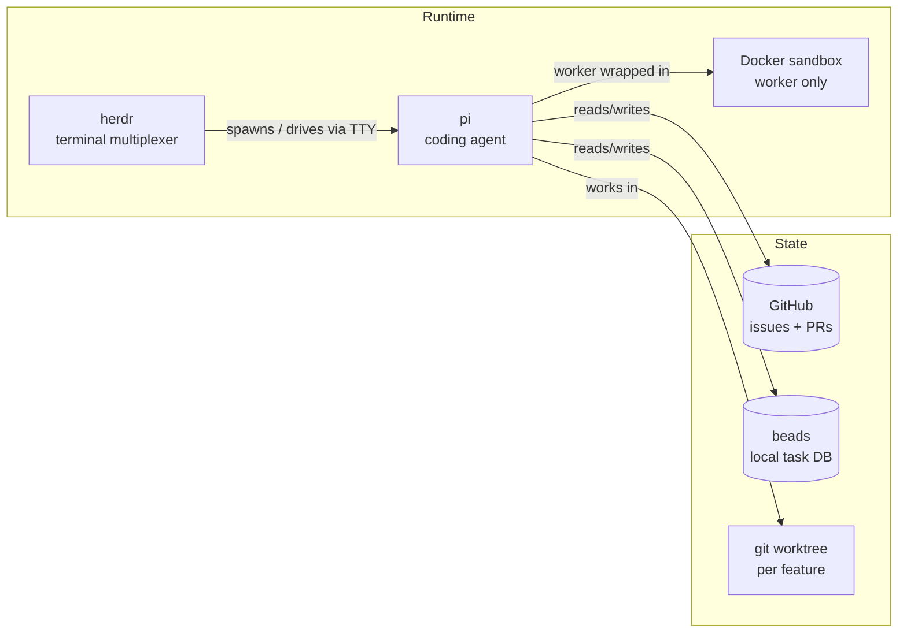
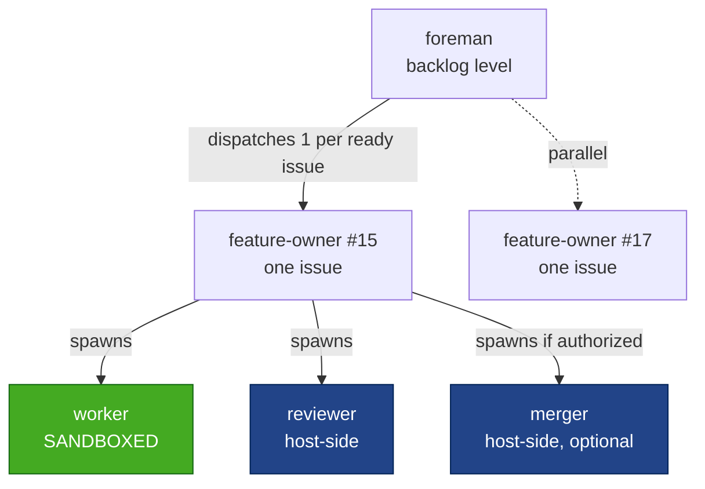
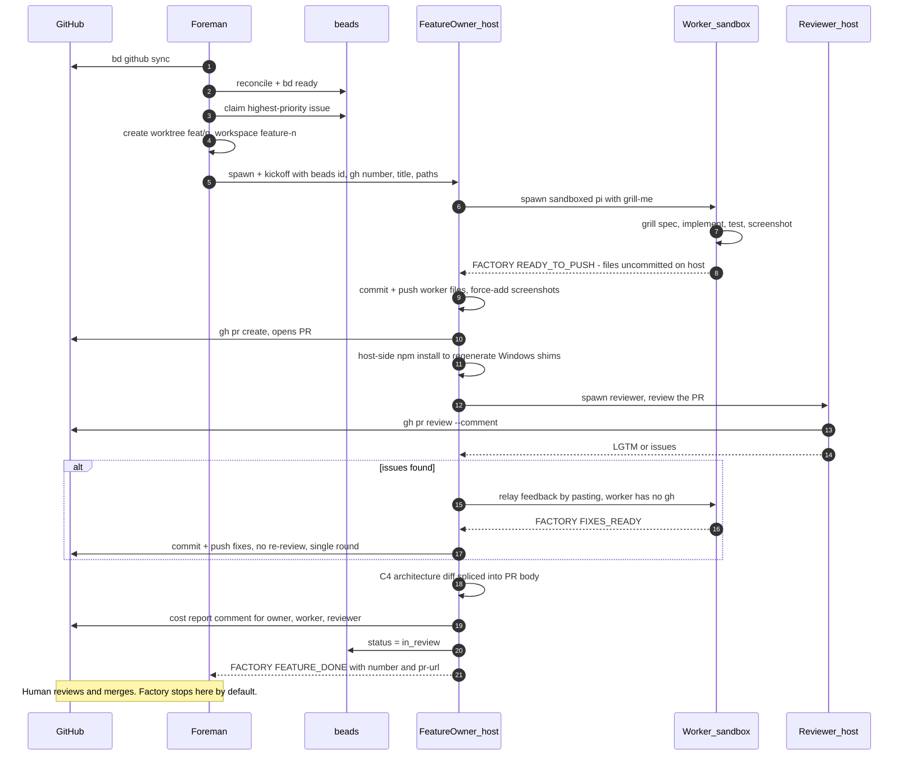
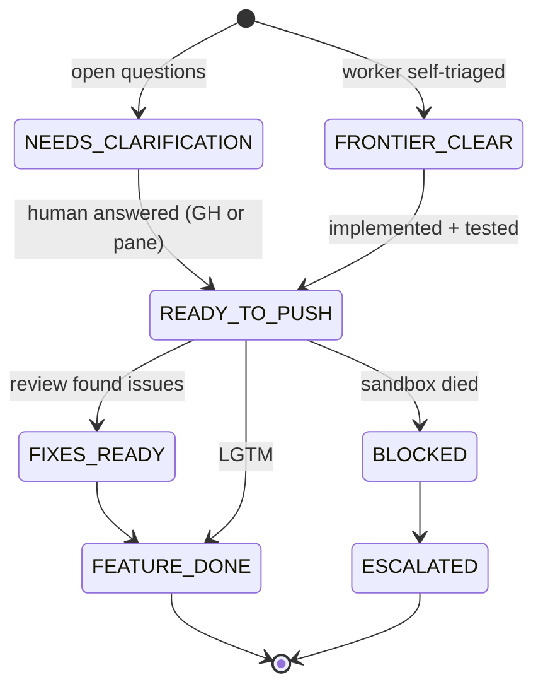
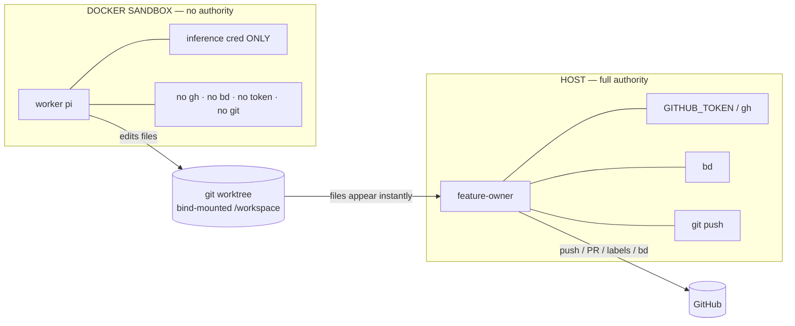
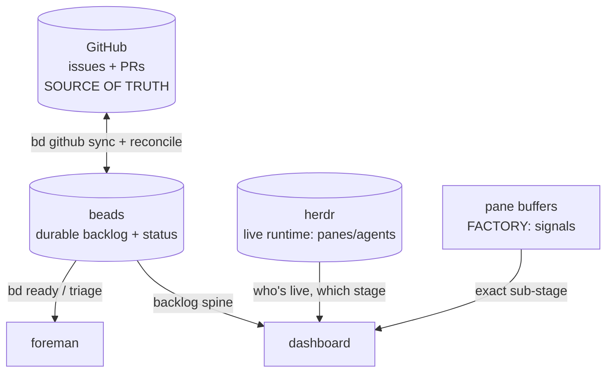
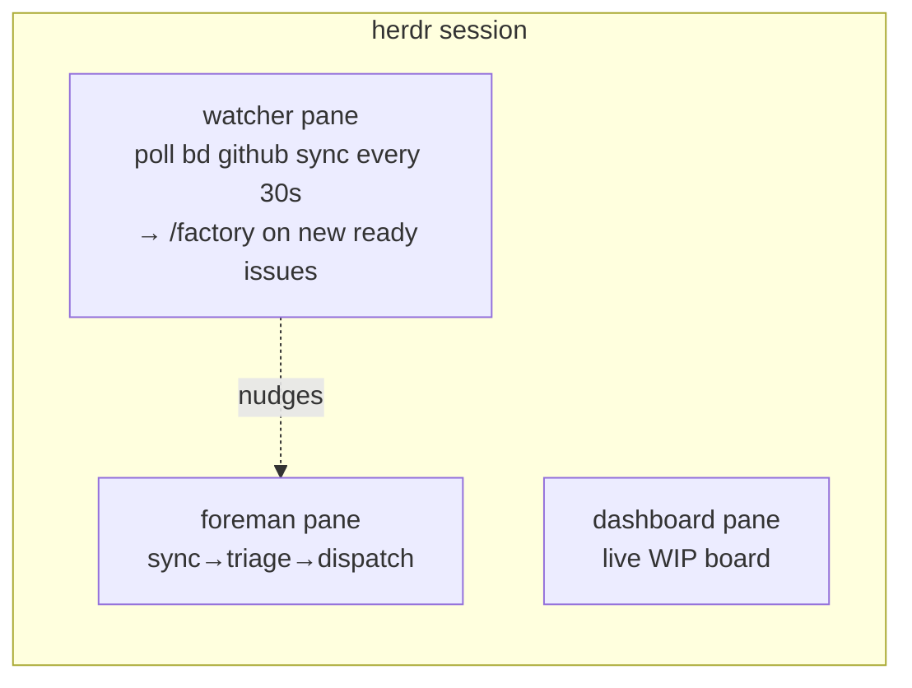

# The Software Factory

An autonomous, multi-agent system that turns **GitHub issues** into **reviewed, green pull
requests** — with minimal human involvement. This document explains how it's designed, the
primitives it's built on, and the rationale behind the key decisions, so an experienced
engineer can grok it at a glance.

---

## 1. TL;DR

- A **foreman** agent watches the GitHub backlog and dispatches one **feature-owner** agent per
  ready issue, each in its own isolated **git worktree**.
- Each **feature-owner** drives a single issue end-to-end by orchestrating three subagents: a
  sandboxed **worker** (implements), a host-side **reviewer** (reviews), and an optional
  **merger** (merges).
- Agents are **pi** sessions running in **herdr** panes. They coordinate not through shared
  memory or APIs, but through **`FACTORY:` text signals** printed to their terminals and read
  back by their parent.
- The **worker runs in a locked-down Docker sandbox** with only an inference credential — it can
  write code but has no `git`, no `gh`, no tokens. All GitHub/beads mutations are performed by
  the feature-owner on the host (the **credential boundary**).
- State lives in three places: **GitHub** (source of truth for issues/PRs), **beads** (durable
  local backlog/task DB), and **herdr** (live runtime — who's running, in which pane).

---

## 2. Design rationale

The factory is deliberately built from **markdown skills + a terminal multiplexer + bash**,
not a bespoke orchestration service. The core insights:

| Decision | Rationale |
|---|---|
| **Agents are skills (markdown), not code** | The "orchestration layer" is prose instructions a pi agent follows. Cheap to change, diff-able, no build step. Behavior is edited by editing docs. |
| **Terminal buffer as the control plane** | herdr detects and drives agents by **scraping the pane's terminal buffer**, not process inspection. This is *why* you can wrap `pi` in `docker run` and still control it — the TTY is the API. |
| **Text signals over structured IPC** | Agents emit `FACTORY:READY_TO_PUSH`, `FACTORY:FEATURE_DONE:<n>:<url>`, etc. Parent agents `wait-output`/`read` for them. No message bus, no shared DB coupling — just greppable stdout. |
| **One worktree per feature** | Isolated git worktrees let feature-owners run in parallel without branch/index conflicts. The worktree *is* the feature's workspace. |
| **Credential boundary** | Agent-authored code (the worker) runs untrusted in a sandbox with **only** an inference credential. Anything with authority (push, PR, labels, bd) is done host-side by the feature-owner. Blast radius of a misbehaving worker ≈ its worktree. |
| **Sandbox the worker only** | The worker is the only agent running agent-authored shell/filesystem workloads. The reviewer just reads a diff; the merger runs `gh`/`bd`. Both stay host-side to keep it simple. |
| **Conservative by default** | The factory stops at a *reviewed, green PR*. Humans merge and close. Auto-merge is opt-in per issue. |
| **GitHub issue number is the canonical id** | Worktrees, branches, session ids, agent names, docker run-ids, and signals all key off the GitHub number (e.g. `15`). The beads id is used **only** for `bd` backend commands. One human-legible id everywhere. |

---

## 3. Primitives (the vocabulary)



- **pi** — the coding agent. Each role (foreman, feature-owner, worker, reviewer, merger) is a
  `pi` process started with a specific `--model` and `--skill` set. On Windows `pi` is a Node
  shell script, so it's launched via `herdr pane run` (not `agent start`, which can't exec it).
- **herdr** — terminal multiplexer for agents. Provides **workspaces → tabs → panes**. Controls
  agents by scraping their terminal buffer: `pane run` (type a prompt), `pane wait-output`
  (await a signal), `pane read` (scrape output), `agent prompt/read/rename` (for host-side pi
  agents it can classify).
- **git worktree** — an isolated checkout on branch `feat/<n>`, labeled `feature-<n>`. One per
  issue; it's also the herdr *workspace* for that feature.
- **Docker sandbox** — a disposable `--rm` container (`factory-<n>`) that runs the worker's `pi`.
  Bind-mounts the worktree at `/workspace`; holds only the inference credential.
- **beads (`bd`)** — durable local issue DB, synced to/from GitHub. The backlog spine.
- **`FACTORY:` signals** — the coordination protocol (see §6).

---

## 4. The agent hierarchy



| Agent | Scope | Sandboxed? | Skills | Responsibilities |
|---|---|---|---|---|
| **foreman** | The **backlog** | No | `foreman`, `herdr`, `beads`, `feature-owner`, `c4-diff` | Sync GitHub → reconcile → triage → claim → create worktree → dispatch a feature-owner. Never touches individual implementation. |
| **feature-owner** | **One issue** | No (host) | `feature-owner`, `herdr`, `beads`, `c4-diff` | Orchestrate the whole lifecycle of one issue. The **only GitHub actor**: every push/PR/label/bd mutation. |
| **worker** | Implementation | **Yes** | `grill-me` only | Grill the spec, implement, run tests, take screenshots. Edits files only — **no git, no commits**. Hands off via signals. |
| **reviewer** | Review | No (host) | `pr-review` | Read the diff (static review only — **no** tests/build, CI owns that), post a review comment. Runs **once** (single round). |
| **merger** | Merge | No (host) | `beads` | Only if auto-merge authorized: merge the PR, close the beads issue. |

**Why the split:** the foreman stays at the backlog level so it can fan out many features in
parallel; each feature-owner owns exactly one issue's messy details. Agents never spawn
"sideways" — the tree is strict.

---

## 5. The end-to-end flow



Key handoffs called out:

- **Worker → feature-owner is `FACTORY:READY_TO_PUSH`.** The worker's edited files are already on
  the host (bind mount) but **uncommitted** — the worker has no git. The feature-owner commits,
  force-adds `artifacts/screenshots/`, pushes, and opens the PR.
- **Clarifications** (`FACTORY:NEEDS_CLARIFICATION`) are surfaced to the **GitHub issue**; the
  feature-owner polls *both* the issue comments and the worker pane, so a human can answer on
  either channel and the owner relays it.
- **Review is a single round.** Issues found → one worker fix pass → proceed (noted as
  unverified in the report). No convergence loop.

---

## 6. The coordination protocol: `FACTORY:` signals

Agents don't share memory. A child prints a signal to its terminal; the parent blocks on
`herdr pane wait-output --regex "FACTORY:..."` and reacts.



| Signal | Emitted by | Meaning / parent action |
|---|---|---|
| `FACTORY:FRONTIER_CLEAR` | worker | Self-triage passed; implementing. Keep monitoring. |
| `FACTORY:NEEDS_CLARIFICATION` | worker | Open design questions → post to GH issue, poll for answer, relay. |
| `FACTORY:READY_TO_PUSH` | worker | Done + tested; files uncommitted → owner commits/pushes/PRs. |
| `FACTORY:FIXES_READY` | worker | Review fixes applied → owner commits/pushes. |
| `FACTORY:BLOCKED` | worker/owner | Container died / unrecoverable. |
| `FACTORY:FEATURE_DONE:<n>:<url>` | feature-owner | Reviewed green PR ready for human merge. |
| `FACTORY:FEATURE_MERGED:<n>:<url>` | feature-owner | Merged (auto-merge was authorized). |
| `FACTORY:FEATURE_ESCALATED:<n>:<url>` | feature-owner | Needs a human. |

`<n>` = **GitHub issue number** (canonical id).

---

## 7. The credential boundary (security model)



- The sandbox is hardened: `--cap-drop ALL`, `--security-opt no-new-privileges`, `--pids-limit`,
  `--memory`, `--cpus`, `--tmpfs /tmp`, `--rm`. Labeled `software-factory.run-id=<n>` for cleanup.
- The worktree is bind-mounted, so the worker's edits land on the host **immediately** — the
  feature-owner commits them. The worker literally *cannot* push or mutate GitHub/beads.
- **Consequence for control:** because the pane's foreground process is `docker` (not `pi`),
  herdr can't classify the worker as an agent on Windows. So the worker is driven with **`pane`**
  commands (`pane run`, `pane wait-output`, `pane read`), using its **pane id** as the handle —
  not `agent prompt/read`. Host-side reviewer/merger classify normally and use `agent` commands.

---

## 8. State & sources of truth



| Store | Nature | Knows | Blind to |
|---|---|---|---|
| **GitHub** | Source of truth | Issues, PRs, comments, merge state | Live agent activity |
| **beads** | Durable backlog | Every issue, priority, status, PR link, history | Fine-grained stage; whether an agent crashed |
| **herdr** | Live runtime | Which agents/panes are alive, their status | Priorities, backlog, closed history (ephemeral) |
| **pane buffers** | Richest, fragile | Exact `FACTORY:` sub-stage | Anything scrolled out of buffer |

**Reconcile** (`factory-reconcile.sh`) exists because `bd github sync` maps GitHub's OPEN state
back to beads `open`, clobbering custom statuses like `in_review`. Reconcile re-derives truth:
closes beads issues whose GH issue is closed, and re-marks issues with existing PRs as
`in_review`.

---

## 9. Observability: the WIP dashboard

`.agents/tools/factory-dashboard.js` renders a live board by **joining all three state sources,
keyed by GitHub issue number**, with a graceful-degradation ladder for the "stage":

```
FACTORY signal (if --signals)  >  herdr agent presence  >  beads status
```

- `bd list` → the row set + priority + PR link (durable spine).
- `herdr pane list` → which roles are live and their status (liveness).
- `herdr pane read` (opt-in `--signals`) → scrape the latest `FACTORY:` line for the exact
  sub-stage (e.g. `implementing`, `review r2`, `done: PR ready`). Best-effort: signals scroll
  out of the buffer, and sandboxed-worker panes aren't classifiable on Windows.

Runs one-shot (`node factory-dashboard.js [--signals|--json]`) or live via the
`.sh`/`.ps1` watch wrappers in a herdr pane.

---

## 10. Startup & continuous operation

Covered by the `start-factory` skill — up to three panes:



1. **Step 1 — foreman** runs one factory pass (single drain of the ready backlog).
2. **Step 2 — watcher** (optional, continuous mode) polls GitHub and sends `/factory` to the
   foreman when new ready issues appear.
3. **Step 3 — dashboard** (recommended) shows the live WIP board.

"Start the factory" ≠ "start the poller" — continuous mode is opt-in.

---

## 11. Layout & naming conventions

```
.agents/
├── FACTORY.md                     ← you are here
├── factory-config.json            ← model tiers + sandbox limits
├── tools/
│   └── factory-dashboard.{js,sh,ps1}
└── skills/
    ├── foreman/                   ← backlog orchestration + scripts
    │   ├── SKILL.md
    │   ├── factory-reconcile.sh   ← fix statuses after sync
    │   ├── factory-watcher.{sh,ps1}
    │   ├── factory-cost-report.sh
    │   ├── factory-bootstrap.sh   ← one-time setup
    │   └── pr-template.md
    ├── feature-owner/             ← single-issue lifecycle
    │   ├── SKILL.md
    │   ├── prompts/               ← worker / reviewer / merger prompt files
    │   └── sandbox/               ← docker run wrapper, image build, cleanup
    ├── pr-review/                 ← reviewer's checklist skill
    ├── grill-me/                  ← worker's spec-interrogation skill
    ├── beads/  herdr/  c4-diff/   ← shared capability skills
    └── start-factory/
```

**Identifier convention:** the **GitHub issue number** (`15`) is canonical everywhere
human/herdr-facing — worktree branch/label (`feat/15`, `feature-15`), session ids, agent names
(`feature-owner-15`, `reviewer-15`), docker run-id/container (`factory-15`), and `FACTORY:`
signals. The **beads id** (`software-factory-demo-…-adb8fc2a`) is used **only** for `bd` backend
commands, because beads is keyed by its own id.

**Model tiers** (`factory-config.json`) let each role run on a different model — e.g. an
expensive model for the worker/owner, a cheaper one for the reviewer.

---

## 12. Known edges & gotchas

- **Skill edits don't reach live worktrees.** Each worktree has its own checkout of `.agents/`.
  Editing a skill in the main repo only affects **new** worktrees (created from `main`) — commit
  first, or edit in the worktree.
- **Sandbox vs host install mismatch.** The worker `npm install`s inside Linux, leaving only Unix
  `.bin` symlinks; the Windows host reviewer needs `.cmd`/`.ps1` shims. The feature-owner runs a
  host-side `npm install` before reviewing to regenerate them.
- **Screenshots must be committed + linked.** They live in `artifacts/screenshots/` (not
  gitignored); the feature-owner force-adds/commits them and rewrites PR-body refs into
  commit-pinned `` images. Private-repo raw URLs 404 to `curl` but
  render in the authenticated web UI.
- **Cleanup coverage is uneven.** Containers: well-covered (`--rm` + `cleanup-orphans.sh` +
  bootstrap sweep). Worktrees: human-gated suggestion only. herdr panes/workspaces: not
  auto-cleaned — they accumulate across a long run.
- **Pane-signal scraping is fragile.** Signals can scroll out of the buffer; sandboxed workers
  aren't agent-classifiable on Windows.
