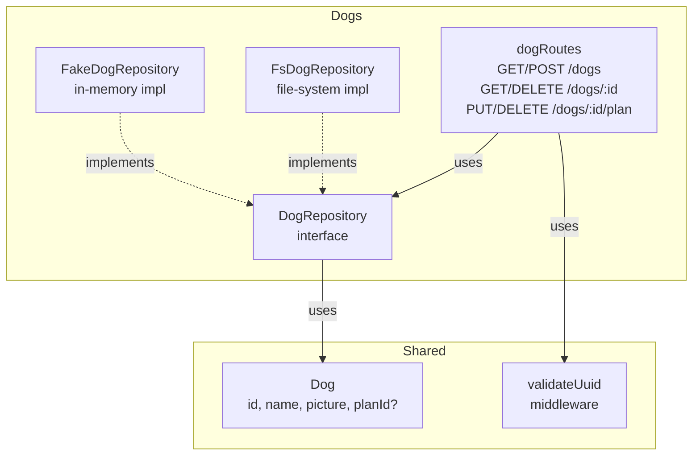
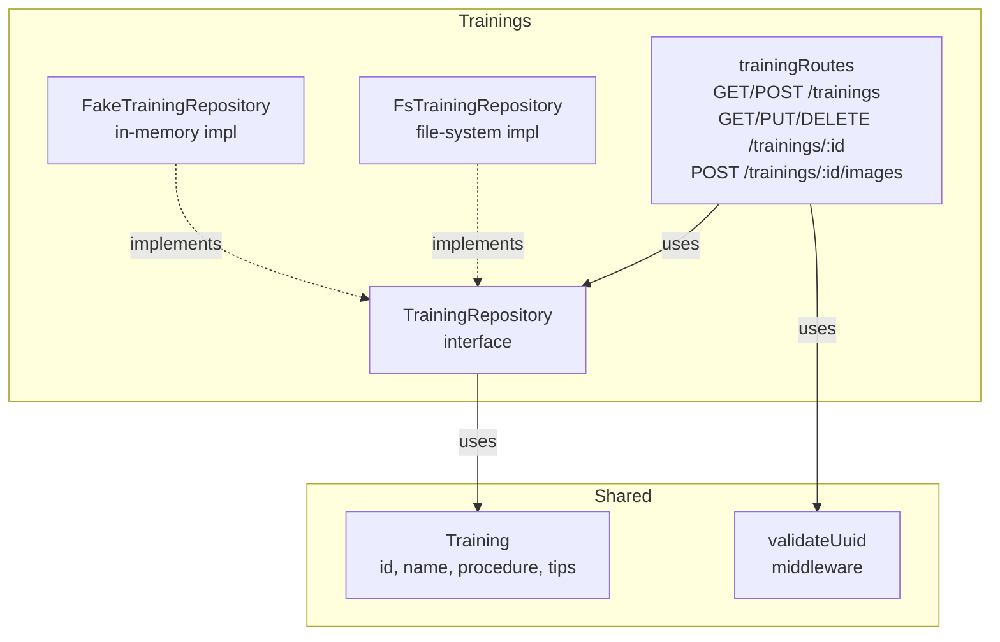
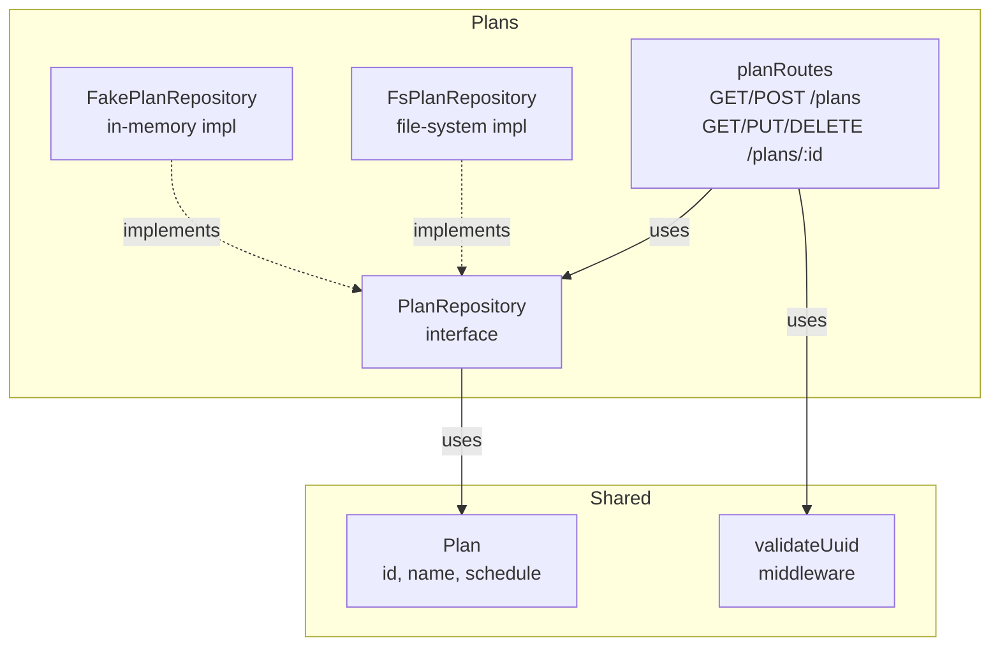
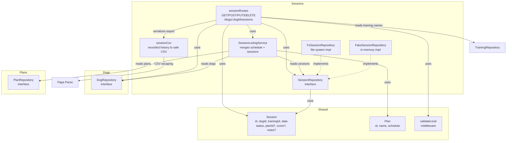

# Backend Architecture - Component Diagrams

## Architecture primitives

* Repositories for data-access
* DDD aggregates for aggregate-level behavior
* Domain services for aggregate-spanning behavior
* Core (domain services+aggregates) gets unit tested using large-scale unit tests using in-memory adapters (repositories etc.)
* The adapters (e.g. routes) should be thin and contain no business logic.

## Component diagram

### Dogs

### Trainings

### Plans

### Sessions

`GET /api/dogs/:dogId/sessions/export.csv` downloads the selected dog's entire
recorded completed/skipped history, sorted by date and then session ID. It reads
the session repository directly, so it neither generates planned entries nor
inherits the progress graph's training/date filters. Unknown dogs return 404;
invalid UUIDs return 400; empty histories return a header-only CSV.

The UTF-8 BOM/CRLF CSV contains `date`, `dogName`, `dogId`, `trainingName`,
`trainingId`, `planId`, `sessionId`, `status`, `score`, and `notes`. Missing values
are empty cells; deleted training names are blank while their IDs are retained.
Names reflect current repository data, not historical snapshots. Papa Parse
quotes CSV delimiters and multiline text and prefixes formula-like text with an
apostrophe for spreadsheet safety.

The download action lives in `ProgressReport`, including its graph view, and is
available without an assigned plan. Download errors stay on the report and can
be retried. No persistence schema changes are required.
