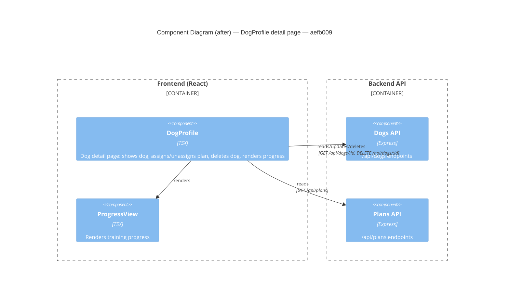

# Component Diagram (after)

**Head:** `aefb009` — feat: add delete dog action to detail page (Jo Van Eyck, 2026-09-14)

## Evidence
- `DogProfile` — `app/frontend/src/DogProfile.tsx`; adds `handleDelete` calling `DELETE /api/dogs/:id` and `navigate('/')` on success.
- Edge `DogProfile → Dogs API` now also covers the delete call.

## Summary
After the change, `DogProfile` gains a delete-dog capability that calls the existing `DELETE /api/dogs/:id` endpoint and navigates to the dog list on success.
