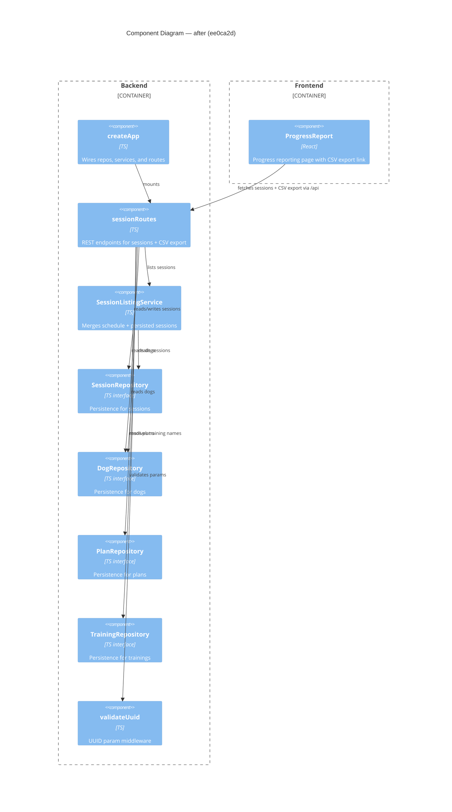

# Component Diagram (after)

**Head:** `ee0ca2d` — fix(sessions): validate date filters and sanitize export filename (Jo Van Eyck, 2026-08-31)

## Evidence
- `createApp` — `app/backend/createApp.ts`: `app.use('/api', sessionRoutes(dogRepo, sessionRepo, sessionListingService, trainingRepo))`
- `sessionRoutes` — `app/backend/sessions/sessionRoutes.ts`: now accepts optional `TrainingRepository`; new `GET /dogs/:dogId/sessions/export` endpoint calls `sessions.getByDogId()` and `trainings.getAll()`
- `SessionRepository` — `app/backend/sessions/SessionRepository.ts`: interface gained `getByDogId(dogId: string): Session[]`
- `ProgressReport` — `app/frontend/src/ProgressReport.tsx`: added `<a href="/api/dogs/${selectedDogId}/sessions/export">` export link
