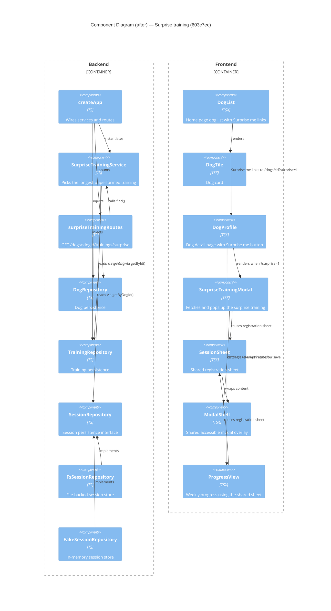

# Component Diagram (after)

**Base:** `39cd615` — live preview (Jo Van Eyck, 2026-09-23)
**Head:** `603c7ec` — fix: address SonarCloud feedback (jo-clank, 2026-09-23)

## Evidence
- `SurpriseTrainingService` — new `app/backend/trainings/SurpriseTrainingService.ts`; constructor injects `TrainingRepository` and `SessionRepository`, `find()` reads `trainings.getAll()` and `sessions.getByDogId(dogId)`.
- `surpriseTrainingRoutes` — new `app/backend/trainings/surpriseTrainingRoutes.ts`; `GET /dogs/:dogId/trainings/surprise`, validates via `dogs.getById(dogId)` and calls `service.find(dogId)`.
- `createApp` — `app/backend/createApp.ts`; `new SurpriseTrainingService(trainingRepo, sessionRepo)` and `app.use('/api', surpriseTrainingRoutes(dogRepo, surpriseTrainingService))`.
- `SessionRepository` — `app/backend/sessions/SessionRepository.ts`; added `getByDogId(dogId)` to the interface.
- `FsSessionRepository` / `FakeSessionRepository` — `app/backend/sessions/{Fs,Fake}SessionRepository.ts`; implement `getByDogId` (Fs delegates to its range query).
- `DogList` — `app/frontend/src/DogList.tsx`; fetches `/api/trainings` independently, renders a `Surprise me` `Link` to `/dogs/${dog.id}?surprise=1`.
- `DogProfile` — `app/frontend/src/DogProfile.tsx`; `Surprise me` button sets `?surprise=1`; renders `SurpriseTrainingModal`; bumps `progressKey` on save.
- `SurpriseTrainingModal` — new `app/frontend/src/SurpriseTrainingModal.tsx`; fetches the surprise training, renders `SessionSheet` (or `ModalShell` for loading/empty).
- `SessionSheet` — new `app/frontend/src/SessionSheet.tsx`; extracted registration form, wrapped in `ModalShell`.
- `ModalShell` — new `app/frontend/src/ModalShell.tsx`; accessible native-button backdrop.
- `ProgressView` — `app/frontend/src/ProgressView.tsx`; inline sheet replaced by `SessionSheet`.

## Summary
A new backend component, `SurpriseTrainingService`, is wired into `createApp` behind the new `surpriseTrainingRoutes` endpoint, and it depends on a new `SessionRepository.getByDogId` accessor implemented by both session repositories. On the frontend, a new `SurpriseTrainingModal` plus two extracted shared components (`SessionSheet`, `ModalShell`) are added; `DogList` and `DogProfile` gain "Surprise me" entry points, and `ProgressView` is refactored to reuse `SessionSheet` instead of its former inline registration sheet.