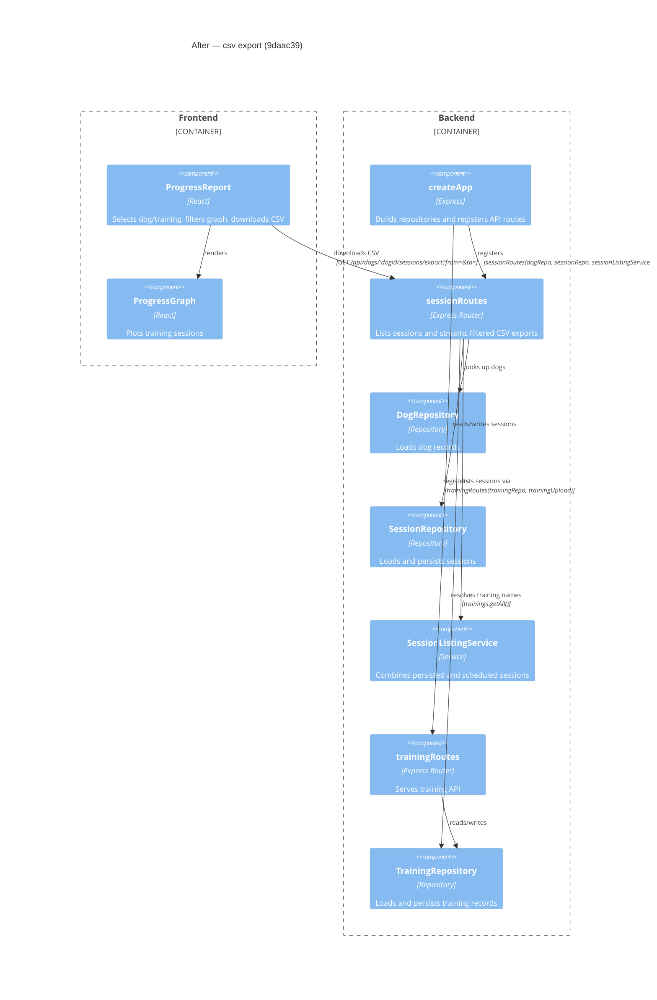

# Component Diagram (after)

**Base:** `fe5a1a1` — use luna 6 (Jo Van Eyck, 2026-09-24)
**Head:** `9daac39` — csv export (jo-clank, 2026-09-24)

## Evidence
- `ProgressReport.exportCsv` requests `/api/dogs/${selectedDogId}/sessions/export` with its active date range; `ProgressReport` also renders `ProgressGraph` (`app/frontend/src/ProgressReport.tsx`).
- `createApp` passes `trainingRepo` as the new fourth argument to `sessionRoutes` (`app/backend/createApp.ts`, `createApp`).
- The export handler calls `trainings.getAll()` to map training IDs to names and reads dog/session repositories (`app/backend/sessions/sessionRoutes.ts`, `sessionRoutes` and `GET /dogs/:dogId/sessions/export`).
- Existing training-route wiring remains through `trainingRoutes(trainingRepo, trainingUpload)` (`app/backend/createApp.ts`, `createApp`; `app/backend/trainings/trainingRoutes.ts`, `trainingRoutes`).

## Summary
The after-state adds a progress-report CSV download path into the existing session router. The router now receives `TrainingRepository` to label session rows with training names; the app factory's session-router wiring changes to provide that dependency. Existing graph rendering and session listing paths remain.
