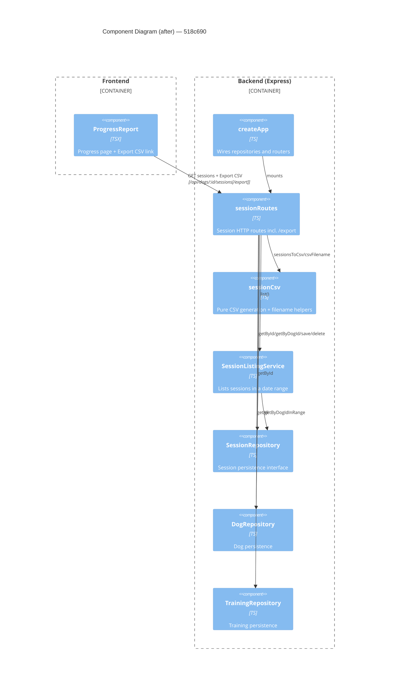

# Component Diagram (after)

**Head:** `518c690` — fix: address review feedback (Jo Van Eyck, 2026-09-14)

## Evidence
- New `sessionCsv.ts` exports `escapeCsvField`, `sessionsToCsv`, `csvFilename`; imported by `sessionRoutes.ts`.
- `sessionRoutes` now receives `trainingRepo` (`createApp.ts`) and calls `trainings.getAll()` in the export route.
- `SessionRepository` gained `getByDogId(dogId)`; export route uses `sessions.getByDogId(dogId)`.
- `ProgressReport.tsx` adds an Export CSV link to `/api/dogs/:id/sessions/export`.

## Summary
Adds a `sessionCsv` component and an `/export` route; `sessionRoutes` now depends on `sessionCsv` and `TrainingRepository`, and the Progress page gains a CSV download link.
