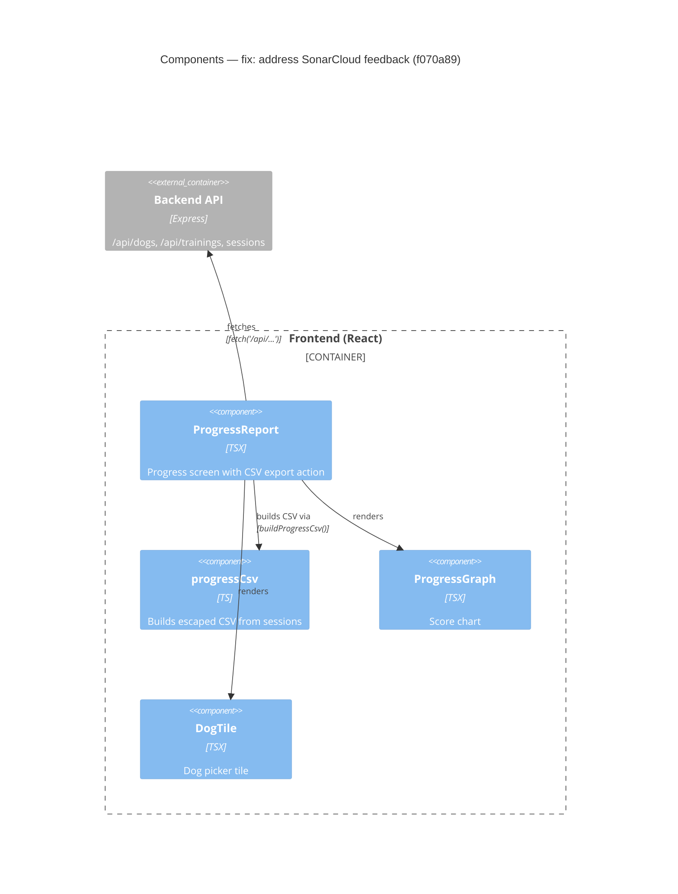

# Component Diagram (after)

**Base:** `6d8309b` — beads (Jo Van Eyck, 2026-09-25)
**Head:** `f070a89` — fix: address SonarCloud feedback (jo-clank, 2026-09-25)

## Evidence
- `app/frontend/src/progressCsv.ts` exports `buildProgressCsv`, imported by `ProgressReport.tsx`.
