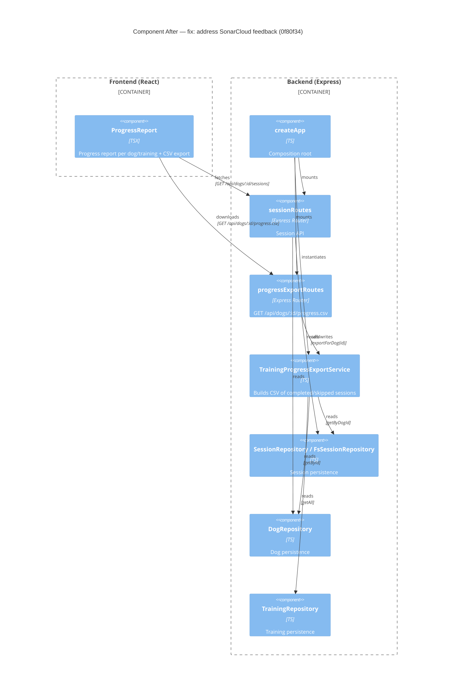

# Component Diagram (after)

**Base:** `098efcf` — opus owner (Jo Van Eyck, 2026-09-25)
**Head:** `0f80f34` — fix: address SonarCloud feedback (jo-clank, 2026-09-25)

```mermaid
C4Component
  title Component After — fix: address SonarCloud feedback (0f80f34)

  Container_Boundary(fe, "Frontend (React)") {
    Component(progressReport, "ProgressReport", "TSX", "Progress report per dog/training + CSV export")
  }
  Container_Boundary(be, "Backend (Express)") {
    Component(createApp, "createApp", "TS", "Composition root")
    Component(sessionRoutes, "sessionRoutes", "Express Router", "Session API")
    Component(exportRoutes, "progressExportRoutes", "Express Router", "GET /api/dogs/:id/progress.csv")
    Component(exportService, "TrainingProgressExportService", "TS", "Builds CSV of completed/skipped sessions")
    Component(sessionRepo, "SessionRepository / FsSessionRepository", "TS", "Session persistence")
    Component(dogRepo, "DogRepository", "TS", "Dog persistence")
    Component(trainingRepo, "TrainingRepository", "TS", "Training persistence")
  }

  Rel(progressReport, sessionRoutes, "fetches", "GET /api/dogs/:id/sessions")
  Rel(progressReport, exportRoutes, "downloads", "GET /api/dogs/:id/progress.csv")
  Rel(createApp, sessionRoutes, "mounts")
  Rel(createApp, exportRoutes, "mounts")
  Rel(createApp, exportService, "instantiates")
  Rel(sessionRoutes, sessionRepo, "reads/writes")
  Rel(sessionRoutes, dogRepo, "reads")
  Rel(exportRoutes, exportService, "calls", "exportForDog(id)")
  Rel(exportService, dogRepo, "reads", "getById")
  Rel(exportService, trainingRepo, "reads", "getAll")
  Rel(exportService, sessionRepo, "reads", "getByDogId")
```
