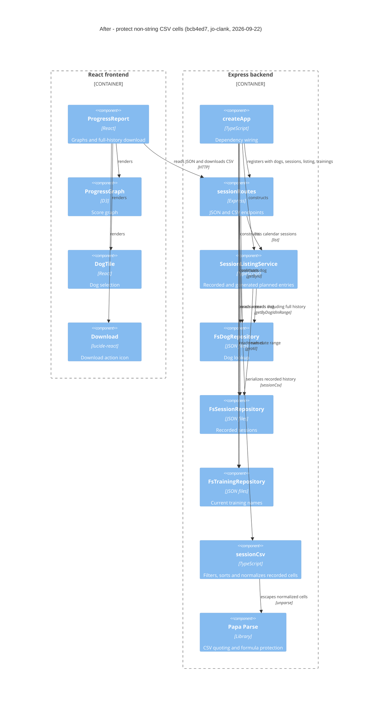

# Component Diagram (After)

**Base:** `37f548c` - cleanup (Jo Van Eyck, 2026-09-19)
**Head:** `bcb4ed7` - fix(sessions): protect non-string CSV cells from formulas (#24) (jo-clank, 2026-09-22)

## Evidence

- [ProgressReport.exportSessions](https://github.com/jovaneyck/software-factory-demo/blob/bcb4ed7/app/frontend/src/ProgressReport.tsx): fetches `/api/dogs/:id/sessions/export.csv`, downloads a Blob, reports failures, and renders the Lucide `Download` icon; graph and tile dependencies are retained.
- [createApp](https://github.com/jovaneyck/software-factory-demo/blob/bcb4ed7/app/backend/createApp.ts): injects `trainingRepo` into `sessionRoutes` alongside its existing dependencies.
- [sessionRoutes](https://github.com/jovaneyck/software-factory-demo/blob/bcb4ed7/app/backend/sessions/sessionRoutes.ts): calls `dogs.getById`, `sessions.getByDogIdInRange`, `trainings.getAll`, and `sessionCsv` for the CSV attachment. The JSON listing path still calls `service.list`.
- [sessionCsv](https://github.com/jovaneyck/software-factory-demo/blob/bcb4ed7/app/backend/sessions/sessionCsv.ts): filters recorded statuses, sorts dates/IDs, resolves names, normalizes cells with `String`, and calls `Papa.unparse` with formula protection.
- [FsTrainingRepository.getAll](https://github.com/jovaneyck/software-factory-demo/blob/bcb4ed7/app/backend/trainings/FsTrainingRepository.ts): existing implementation supplies current names; no storage changes.

## Summary

The serializer, Papa Parse dependency, and download icon are new. The report gains a CSV HTTP operation; session routes gain training-name lookup and serialization; the composition root injects that repository. Nothing is removed. Existing JSON listing behavior, graph rendering, repository implementations, and persisted schemas remain unchanged. Unrelated routes and unchanged plan dependencies are omitted.