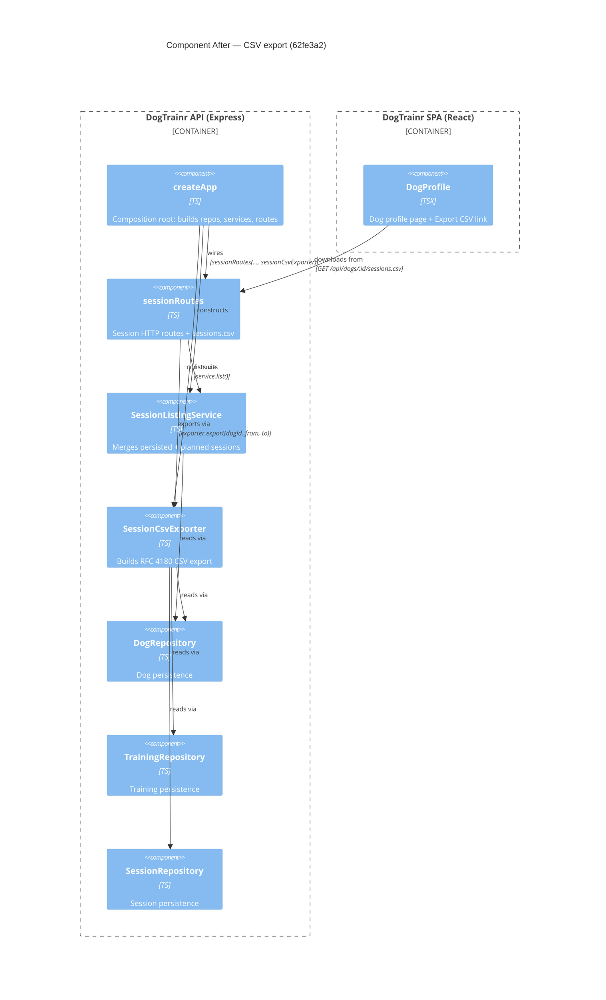

# Component Diagram (after)

**Base:** `961e4be` — chore(factory): set worker/feature-owner/reviewer/merger tiers to deepseek (Jo Van Eyck, 2026-09-14)
**Head:** `62fe3a2` — fix: address review feedback (CSV formula injection) (jo-clank, 2026-09-14)

## Evidence
- `SessionCsvExporter` — new class in `app/backend/sessions/SessionCsvExporter.ts`; constructor takes `DogRepository`, `TrainingRepository`, `SessionRepository`.
- `createApp` — constructs the exporter and passes it to `sessionRoutes` in `app/backend/createApp.ts` (`new SessionCsvExporter(dogRepo, trainingRepo, sessionRepo)`).
- `sessionRoutes` — new `router.get('/dogs/:dogId/sessions.csv', ...)` handler calling `exporter.export(...)` in `app/backend/sessions/sessionRoutes.ts`.
- `DogProfile` — new `<a href={\`/api/dogs/${dog.id}/sessions.csv\`}>Export CSV</a>` link in `app/frontend/src/DogProfile.tsx`.

## Summary
After the change, a new `SessionCsvExporter` component joins the backend, translating a dog's recorded sessions into an RFC 4180 CSV (with formula-injection neutralisation) using the three repositories. `sessionRoutes` gains the `sessions.csv` endpoint and the exporter dependency, `createApp` wires it, and `DogProfile` gains an export link that drives the download.
