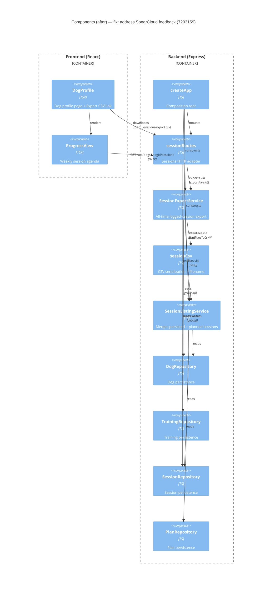

# Component Diagram (after)

**Base:** `c0cc5b0` — model routing: deepseek + opus (Jo Van Eyck, 2026-10-04)
**Head:** `7293159` — fix: address SonarCloud feedback (jo-clank, 2026-10-04) — tip of PR #38 `feat/37` source changes

```mermaid
C4Component
  title Components (after) — fix: address SonarCloud feedback (7293159)

  Container_Boundary(fe, "Frontend (React)") {
    Component(dogProfile, "DogProfile", "TSX", "Dog profile page + Export CSV link")
    Component(progressView, "ProgressView", "TSX", "Weekly session agenda")
  }
  Container_Boundary(be, "Backend (Express)") {
    Component(createApp, "createApp", "TS", "Composition root")
    Component(sessionRoutes, "sessionRoutes", "TS", "Sessions HTTP adapter")
    Component(exportSvc, "SessionExportService", "TS", "All-time logged-session export")
    Component(sessionCsv, "sessionCsv", "TS", "CSV serialization + filename")
    Component(listing, "SessionListingService", "TS", "Merges persisted + planned sessions")
    Component(dogRepo, "DogRepository", "TS", "Dog persistence")
    Component(trainingRepo, "TrainingRepository", "TS", "Training persistence")
    Component(sessionRepo, "SessionRepository", "TS", "Session persistence")
    Component(planRepo, "PlanRepository", "TS", "Plan persistence")
  }

  Rel(dogProfile, progressView, "renders")
  Rel(progressView, sessionRoutes, "GET /api/dogs/:dogId/sessions", "HTTP")
  Rel(dogProfile, sessionRoutes, "downloads", "GET .../sessions/export.csv")
  Rel(createApp, sessionRoutes, "mounts")
  Rel(createApp, listing, "constructs")
  Rel(createApp, exportSvc, "constructs")
  Rel(sessionRoutes, listing, "lists via", "list()")
  Rel(sessionRoutes, exportSvc, "exports via", "export(dogId)")
  Rel(sessionRoutes, dogRepo, "reads")
  Rel(sessionRoutes, sessionRepo, "reads/writes")
  Rel(exportSvc, dogRepo, "reads", "getById()")
  Rel(exportSvc, listing, "lists via", "list()")
  Rel(exportSvc, trainingRepo, "reads names", "getAll()")
  Rel(exportSvc, sessionCsv, "serializes via", "sessionsToCsv()")
  Rel(listing, dogRepo, "reads")
  Rel(listing, planRepo, "reads")
  Rel(listing, sessionRepo, "reads")
```

## Evidence
- `app/backend/sessions/SessionExportService.ts` — constructor(dogs, listing, trainings); `export()` calls `sessionsToCsv`/`sessionsFilename`.
- `app/backend/sessions/sessionRoutes.ts` — new `GET /dogs/:dogId/sessions/export.csv` calling `exportService.export`.
- `app/backend/createApp.ts` — `new SessionExportService(dogRepo, sessionListingService, trainingRepo)`.
- `app/frontend/src/DogProfile.tsx` — `<a href=/api/dogs/${id}/sessions/export.csv download>`.
