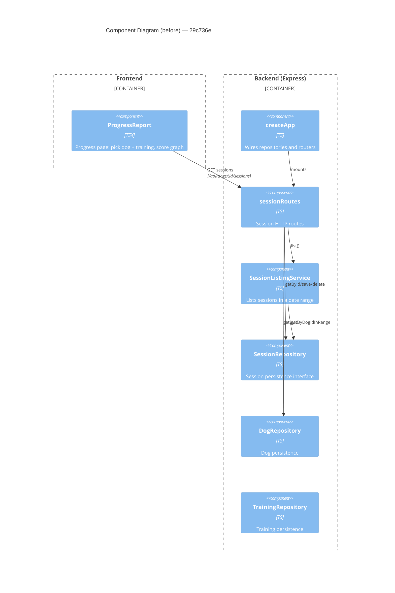

# Component Diagram (before)

**Base:** `29c736e` — fix(factory): beads/github id confusion (Jo Van Eyck, 2026-09-14)

## Evidence
- `sessionRoutes` receives `(dogRepo, sessionRepo, sessionListingService)` in `createApp.ts`.
- `SessionRepository` interface exposes `getById`, `getByDogIdInRange`, `save`, `delete`.
- `ProgressReport.tsx` fetches `/api/dogs/:id/sessions?from&to`.

## Summary
Baseline: the Progress page reads range-filtered sessions; `sessionRoutes` depends on the listing service, session and dog repositories. There is no CSV export and no `TrainingRepository` wiring into `sessionRoutes`.
