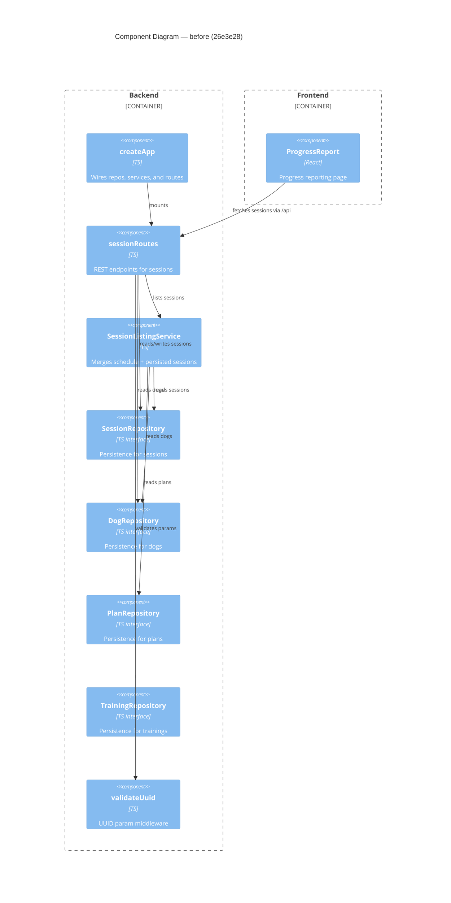

# Component Diagram (before)

**Base:** `26e3e28` — herdr workaround for foreman poke (Jo Van Eyck, 2026-08-31)

## Evidence
- `createApp` — `app/backend/createApp.ts`: `app.use('/api', sessionRoutes(dogRepo, sessionRepo, sessionListingService))`
- `sessionRoutes` — `app/backend/sessions/sessionRoutes.ts`: accepts `DogRepository`, `SessionRepository`, `SessionListingService`
- `SessionListingService` — `app/backend/sessions/SessionListingService.ts`: injected with `DogRepository`, `PlanRepository`, `SessionRepository`
- `SessionRepository` — `app/backend/sessions/SessionRepository.ts`: interface with `getById`, `getByDogIdInRange`, `save`, `delete`
- `ProgressReport` — `app/frontend/src/ProgressReport.tsx`: fetches `/api/dogs/:dogId/sessions`
