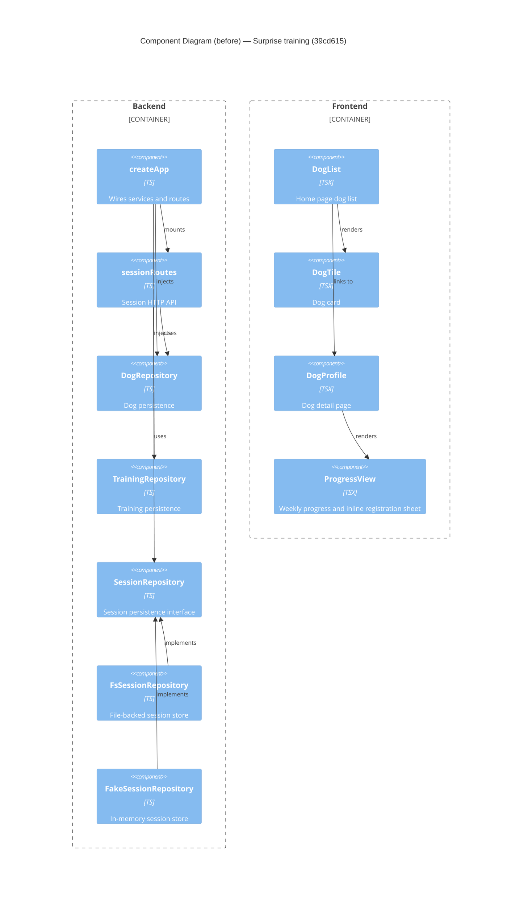

# Component Diagram (before)

**Base:** `39cd615` — live preview (Jo Van Eyck, 2026-09-23)
**Head:** `603c7ec` — fix: address SonarCloud feedback (jo-clank, 2026-09-23)

## Evidence
- `createApp` — `app/backend/createApp.ts`; constructs `SessionListingService` and mounts `sessionRoutes`, `dogRoutes`, `trainingRoutes`, `planRoutes`.
- `sessionRoutes` — `app/backend/sessions/sessionRoutes.ts`; consumes `DogRepository` and `SessionRepository`.
- `SessionRepository` — `app/backend/sessions/SessionRepository.ts`; interface with `getByDogId` absent at this commit (only `getByTrainingAndDate` / range queries).
- `FsSessionRepository` / `FakeSessionRepository` — `app/backend/sessions/{Fs,Fake}SessionRepository.ts`; `implements SessionRepository`.
- `DogList` — `app/frontend/src/DogList.tsx`; fetches `/api/dogs` and renders `DogTile`, linking to `/dogs/:id`.
- `DogProfile` — `app/frontend/src/DogProfile.tsx`; renders `ProgressView`.
- `ProgressView` — `app/frontend/src/ProgressView.tsx`; contains an inline registration sheet (no shared component).

## Summary
Nothing exists for "surprise training" yet. Sessions are reachable only through `sessionRoutes` and a dog-scoped range query; the `SessionRepository` interface has no `getByDogId` accessor. On the frontend, the registration sheet lives inline inside `ProgressView`, so there is no reusable component to pop up a training registration from elsewhere.