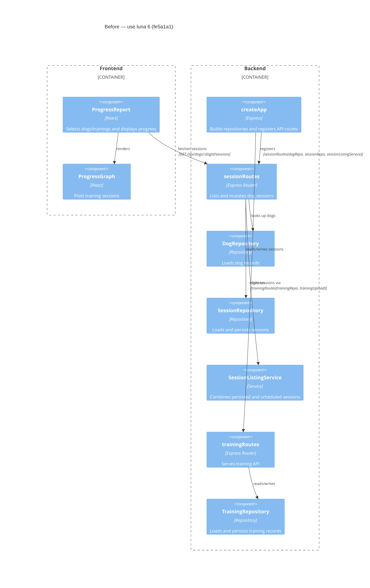

# Component Diagram (before)

**Base:** `fe5a1a1` — use luna 6 (Jo Van Eyck, 2026-09-24)
**Head:** `9daac39` — csv export (jo-clank, 2026-09-24)

## Evidence
- `ProgressReport` renders `ProgressGraph` and fetches the dog session listing in `app/frontend/src/ProgressReport.tsx` (`ProgressReport`, session-listing `fetch`).
- `createApp` registers `sessionRoutes` with the dog repository, session repository, and listing service in `app/backend/createApp.ts` (`createApp`).
- `sessionRoutes` receives and calls its dog/session repositories and `SessionListingService` in `app/backend/sessions/sessionRoutes.ts` (`sessionRoutes`).
- `createApp` registers `trainingRoutes(trainingRepo, trainingUpload)`; `trainingRoutes` receives its repository in `app/backend/trainings/trainingRoutes.ts` (`trainingRoutes`).

## Summary
Before this change, the progress report could request session data and render a graph, while the backend session router served session APIs using the dog/session repositories and listing service. There was no CSV download request or session-router dependency on the training repository.
