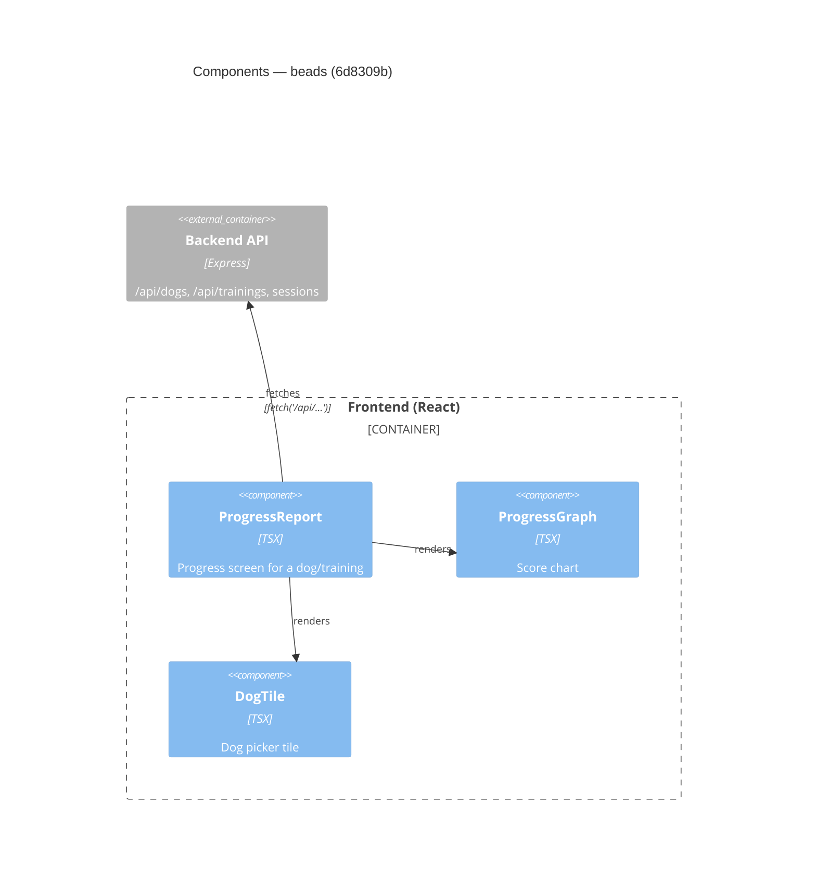

# Component Diagram (before)

**Base:** `6d8309b` — beads (Jo Van Eyck, 2026-09-25)
**Head:** `f070a89` — fix: address SonarCloud feedback (jo-clank, 2026-09-25)

## Evidence
- `app/frontend/src/ProgressReport.tsx` imports `ProgressGraph`, `DogTile`; calls `fetch('/api/dogs')`, `/api/dogs/:id/sessions`, `/api/trainings`.
