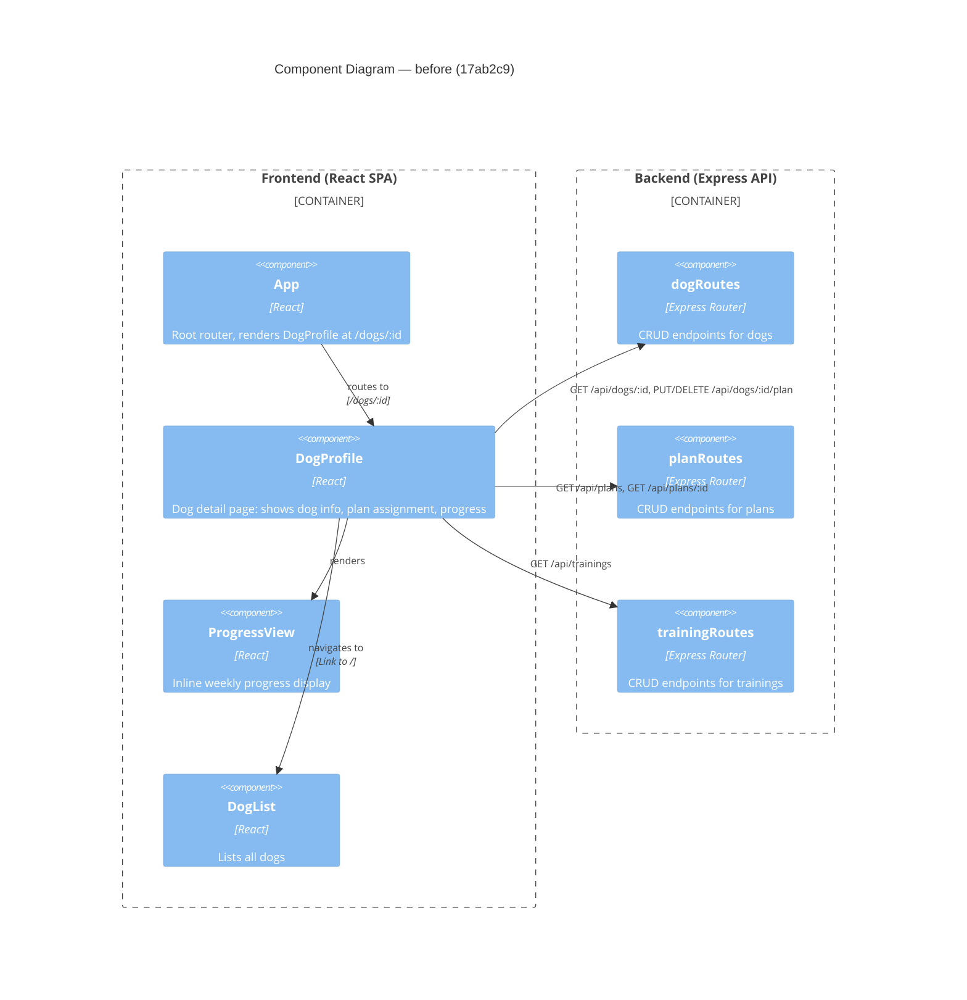

# Component Diagram (before)

**Base:** `17ab2c9` — le format (Jo Van Eyck, 2026-08-27)

## Evidence
- `App` routes to `DogProfile` — `app/frontend/src/App.tsx` (`<Route path="/dogs/:id" element={<DogProfile />} />`).
- `DogProfile` renders `ProgressView` — `app/frontend/src/DogProfile.tsx` (`import ProgressView`; `<ProgressView dogId={id!} ... />`).
- `DogProfile` calls `dogRoutes` — `fetch(/api/dogs/${id})`, `fetch(/api/dogs/${id}/plan, {method:'PUT'})`, `fetch(/api/dogs/${id}/plan, {method:'DELETE'})`.
- `DogProfile` calls `planRoutes` — `fetch('/api/plans')`, `fetch(/api/plans/${...})`.
- `DogProfile` calls `trainingRoutes` — `fetch('/api/trainings')`.
- `DogProfile` links to dog list — `<Link to="/">` (Back link).
