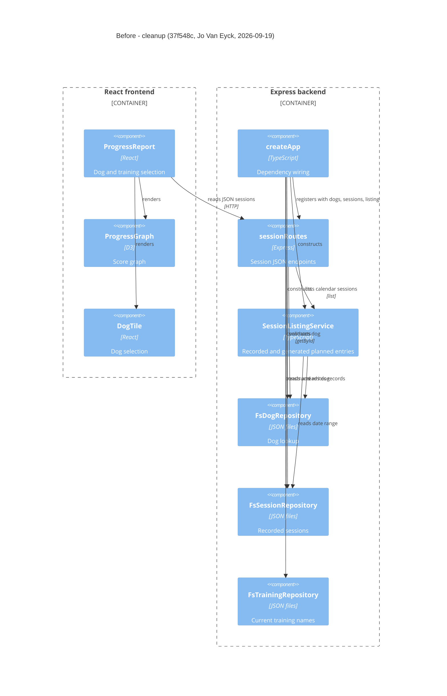

# Component Diagram (Before)

**Base:** `37f548c` - cleanup (Jo Van Eyck, 2026-09-19)
**Head:** `bcb4ed7` - fix(sessions): protect non-string CSV cells from formulas (#24) (jo-clank, 2026-09-22)

## Evidence

- [ProgressReport](https://github.com/jovaneyck/software-factory-demo/blob/37f548c/app/frontend/src/ProgressReport.tsx): renders `ProgressGraph`/`DogTile` and fetches session JSON; no download action or icon dependency.
- [createApp](https://github.com/jovaneyck/software-factory-demo/blob/37f548c/app/backend/createApp.ts): constructs repositories/listing and calls `sessionRoutes(dogRepo, sessionRepo, sessionListingService)`.
- [sessionRoutes](https://github.com/jovaneyck/software-factory-demo/blob/37f548c/app/backend/sessions/sessionRoutes.ts): depends on dogs, sessions, and the listing service; no CSV serializer or training repository dependency.
- [SessionListingService](https://github.com/jovaneyck/software-factory-demo/blob/37f548c/app/backend/sessions/SessionListingService.ts): reads dog/session records and combines them with scheduled entries. Unchanged plan dependencies and unrelated routes are omitted from this export-focused view.

## Summary

The baseline supports JSON session records and calendar/graph rendering. No CSV component exists. Training persistence already exists but is not injected into session routes. Repository implementations and storage are unchanged by the later export feature.