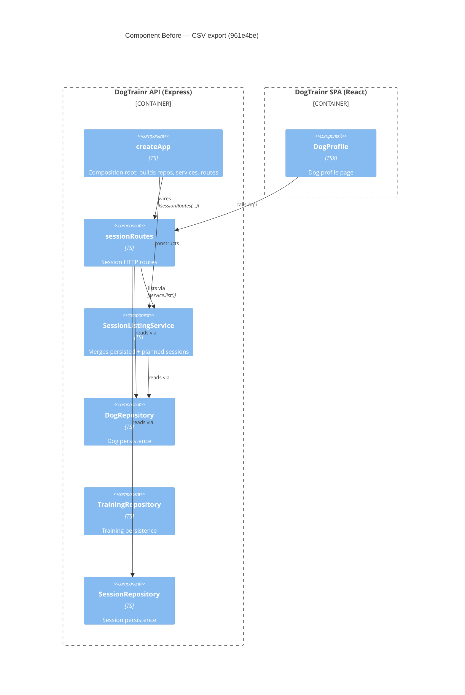

# Component Diagram (before)

**Base:** `961e4be` — chore(factory): set worker/feature-owner/reviewer/merger tiers to deepseek (Jo Van Eyck, 2026-09-14)
**Head:** `62fe3a2` — fix: address review feedback (CSV formula injection) (jo-clank, 2026-09-14)

## Evidence
- `SessionListingService` — constructed and injected in `app/backend/createApp.ts` (`new SessionListingService(dogRepo, planRepo, sessionRepo)`).
- `sessionRoutes` — receives `dogs`, `sessions`, `service` from `createApp` (`sessionRoutes(dogRepo, sessionRepo, sessionListingService)`).
- `SessionRepository`, `DogRepository` — typed imports in `app/backend/sessions/sessionRoutes.ts`.
- `DogProfile` — fetches dog/session/plan data from the Express API in `app/frontend/src/DogProfile.tsx`.

## Summary
Before the change, the session surface exposes only listing/CRUD routes backed by `SessionListingService` and the repositories. There is no CSV/export component, and `DogProfile` has no download control.
