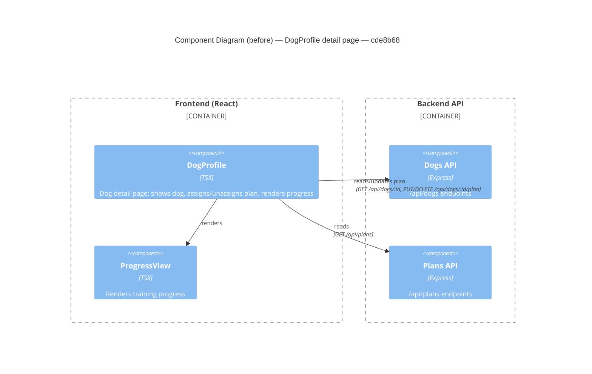

# Component Diagram (before)

**Base:** `cde8b68` — start factory cleanup (Jo Van Eyck, 2026-09-14)

## Evidence
- `DogProfile` — `app/frontend/src/DogProfile.tsx`; fetches `/api/dogs/:id`, assigns/unassigns via `/api/dogs/:id/plan`.
- `ProgressView` — imported and rendered in `DogProfile.tsx`.
- Edges to `Dogs API` / `Plans API` — `fetch()` calls in `DogProfile.tsx`.

## Summary
Baseline structure of the dog detail page before the delete feature: `DogProfile` reads a dog, manages plan assignment, and renders `ProgressView`.
