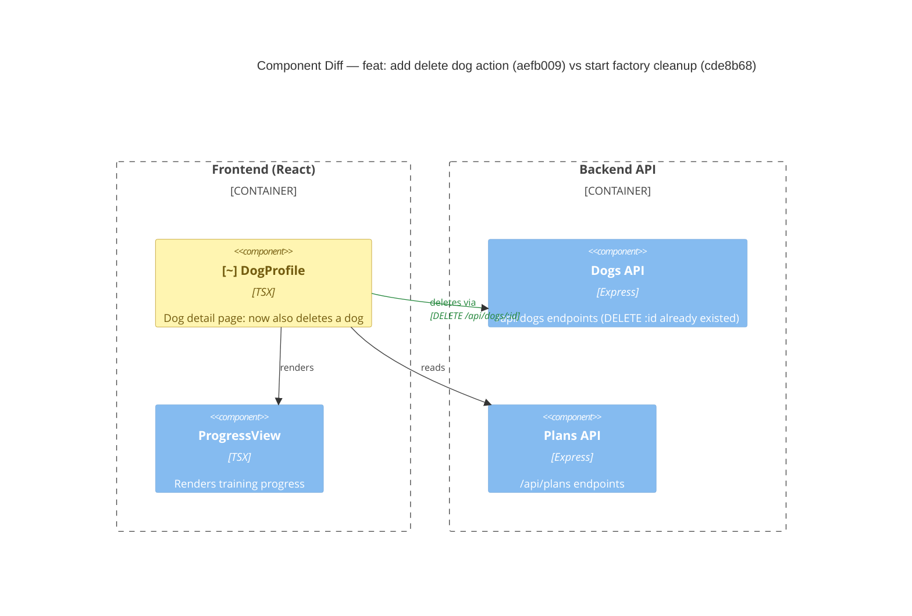

# Component Diagram (diff)

**Base:** `cde8b68` — start factory cleanup (Jo Van Eyck, 2026-09-14)
**Head:** `aefb009` — feat: add delete dog action to detail page (Jo Van Eyck, 2026-09-14)

## Legend
🟢 added  🔴 removed  🟠 changed  ⚪ unchanged (context)

## Evidence
- 🟠 `DogProfile` — `app/frontend/src/DogProfile.tsx`: adds `handleDelete` (`window.confirm` → `fetch(DELETE /api/dogs/:id)` → `navigate('/')`) and a "Danger Zone" delete button; imports `useNavigate`.
- 🟢 `DogProfile → Dogs API` delete edge — new `fetch('/api/dogs/:id', { method: 'DELETE' })` usage. The backend endpoint itself already existed, so no backend node changed.

## Summary
No new components or removed components. The only structural change is that `DogProfile` gained an outbound relationship to the already-existing `Dogs API` `DELETE /api/dogs/:id` endpoint (plus a client-side navigation to the dog list). All backend structure is unchanged.
