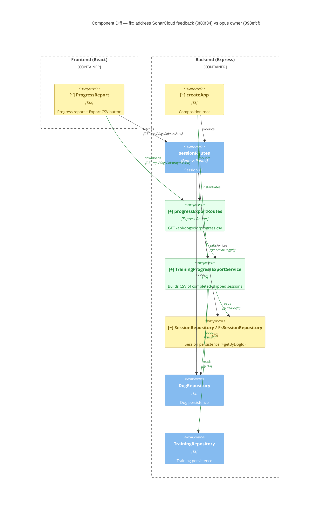

# Component Diagram (diff)

**Base:** `098efcf` — opus owner (Jo Van Eyck, 2026-09-25)
**Head:** `0f80f34` — fix: address SonarCloud feedback (jo-clank, 2026-09-25)

## Legend
🟢 added  🔴 removed  🟠 changed  ⚪ unchanged (context)

## Evidence
- 🟢 `progressExportRoutes` — new `app/backend/sessions/progressExportRoutes.ts`; `router.get('/dogs/:id/progress.csv')` calls `service.exportForDog`.
- 🟢 `TrainingProgressExportService` — new `app/backend/sessions/TrainingProgressExportService.ts`; constructor takes `DogRepository`, `TrainingRepository`, `SessionRepository`.
- 🟠 `createApp` — `app/backend/createApp.ts` instantiates `TrainingProgressExportService` and mounts `progressExportRoutes` under `/api`.
- 🟠 `SessionRepository` — `getByDogId(dogId)` added to the interface, `FsSessionRepository` and `FakeSessionRepository`.
- 🟠 `ProgressReport` — `app/frontend/src/ProgressReport.tsx` `exportProgress()` fetches `/api/dogs/${id}/progress.csv` and triggers a blob download.

## Summary
New: a backend CSV export endpoint (`progressExportRoutes`) backed by `TrainingProgressExportService`, which combines dog, training and session data into a per-session CSV of completed/skipped sessions. Nothing was removed. Changed relationships: `createApp` wires the new service/router, `SessionRepository` gains `getByDogId`, and the frontend `ProgressReport` now calls the new endpoint.
