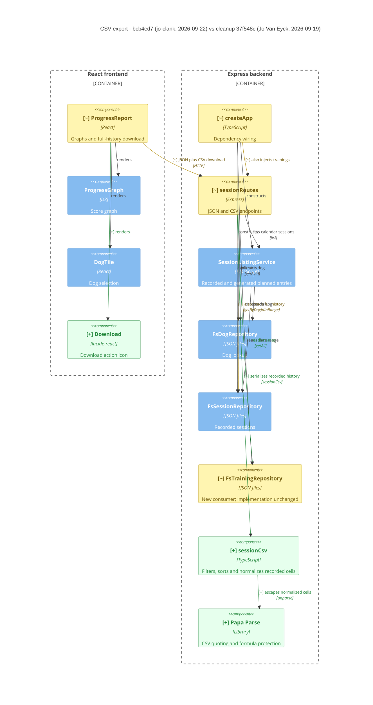

# Component Diagram (Diff)

**Base:** `37f548c` - cleanup (Jo Van Eyck, 2026-09-19)
**Head:** `bcb4ed7` - fix(sessions): protect non-string CSV cells from formulas (#24) (jo-clank, 2026-09-22)

## Legend

Green `[+]`: added. Amber `[~]`: changed behavior or relationship. Default: unchanged context. No removals. The training repository is amber only because it gains a consumer; its implementation is unchanged.

## Evidence

- [ProgressReport.exportSessions](https://github.com/jovaneyck/software-factory-demo/blob/bcb4ed7/app/frontend/src/ProgressReport.tsx): new CSV fetch/Blob download and `Download` import; graph/tile rendering retained.
- [createApp](https://github.com/jovaneyck/software-factory-demo/blob/bcb4ed7/app/backend/createApp.ts): adds `trainingRepo` to the session-route factory call.
- [sessionRoutes](https://github.com/jovaneyck/software-factory-demo/blob/bcb4ed7/app/backend/sessions/sessionRoutes.ts): new export handler reads full persisted history and current training names, then invokes `sessionCsv`; JSON listing still uses `SessionListingService`.
- [sessionCsv](https://github.com/jovaneyck/software-factory-demo/blob/bcb4ed7/app/backend/sessions/sessionCsv.ts): new module normalizes cells before `Papa.unparse` applies CSV and formula escaping.
- [Before](https://github.com/jovaneyck/software-factory-demo/blob/feat/24/artifacts/before.component.md) and [after](https://github.com/jovaneyck/software-factory-demo/blob/feat/24/artifacts/after.component.md) provide the single-state diagrams.

## Summary

Added a CSV serializer and library/icon dependencies. Changed report-to-API behavior and route dependency wiring to support full recorded-history downloads. Removed nothing; no database, persistence schema, service deployment, or existing JSON API changes. The graph and calendar listing remain unchanged. This export-focused subgraph omits unrelated route wiring and unchanged plan dependencies.