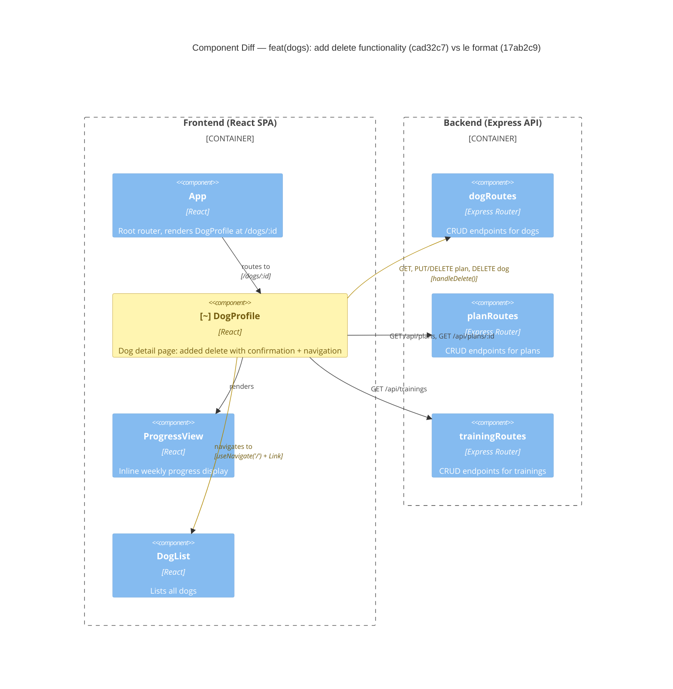

# Component Diagram (diff)

**Base:** `17ab2c9` — le format (Jo Van Eyck, 2026-08-27)
**Head:** `cad32c7` — docs: update architecture artifact head references to final PR commit (Jo Van Eyck, 2026-08-31)

## Legend
🟢 added  🔴 removed  🟠 changed  ⚪ unchanged (context)

## Evidence
- 🟠 `DogProfile` — gained `useNavigate` import and `handleDelete` function in `app/frontend/src/DogProfile.tsx`. New Delete Dog button calls `window.confirm()`, then `fetch(/api/dogs/${id}, {method:'DELETE'})` wrapped in `try/catch`, then `navigate('/')` on success. Both non-OK responses and rejected promises show a failure alert.
- 🟠 `DogProfile → dogRoutes` — relationship expanded: previously called `GET /api/dogs/:id`, `PUT /api/dogs/:id/plan`, `DELETE /api/dogs/:id/plan`. Now additionally calls `DELETE /api/dogs/:id` (the dog-level delete endpoint).
- 🟠 `DogProfile → DogList` — navigation mechanism expanded: previously only `<Link to="/">` (Back link). Now also `navigate('/')` via `useNavigate` after successful delete, providing programmatic navigation.

## Summary
No components were added or removed. `DogProfile` was changed to use an existing backend endpoint (`DELETE /api/dogs/:id`) that was already wired in `dogRoutes`. The component gained a new outbound call to the dog delete endpoint and programmatic navigation to the dog list after deletion. All other components and relationships remain unchanged. This is a purely additive frontend change — no backend modifications were needed.
