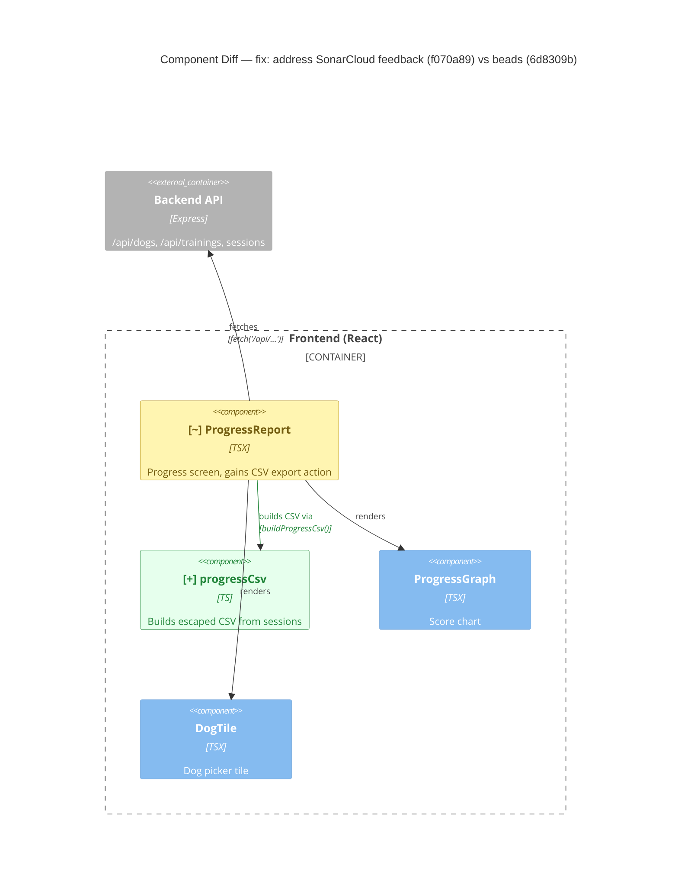

# Component Diagram (diff)

**Base:** `6d8309b` — beads (Jo Van Eyck, 2026-09-25)
**Head:** `f070a89` — fix: address SonarCloud feedback (jo-clank, 2026-09-25)

## Legend
🟢 added  🔴 removed  🟠 changed  ⚪ unchanged (context)

## Evidence
- 🟢 `progressCsv`: new module `app/frontend/src/progressCsv.ts` (`buildProgressCsv`, `escapeCell` with quote escaping + formula-injection guard).
- 🟢 Edge ProgressReport → progressCsv: `import { buildProgressCsv } from './progressCsv'` in `ProgressReport.tsx`.
- 🟠 `ProgressReport`: adds an export button that builds a CSV Blob and triggers a download (`link.download = progress-<dog>-<training>-<range>.csv`).

## Summary
One frontend module is new: `progressCsv`, which turns the filtered sessions into CSV. `ProgressReport` now calls it and downloads the file in the browser. Nothing was removed. The backend and API calls are unchanged; the export reuses session data that has already been fetched.
