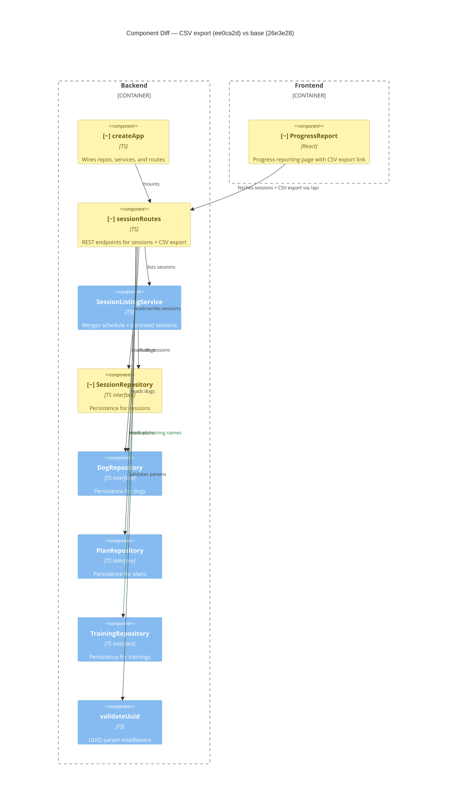

# Component Diagram (diff)

**Base:** `26e3e28` — herdr workaround for foreman poke (Jo Van Eyck, 2026-08-31)
**Head:** `ee0ca2d` — fix(sessions): validate date filters and sanitize export filename (Jo Van Eyck, 2026-08-31)

## Legend
🟢 added  🔴 removed  🟠 changed  ⚪ unchanged (context)

## Evidence
- 🟠 `createApp` — `app/backend/createApp.ts`: wiring changed from `sessionRoutes(dogRepo, sessionRepo, sessionListingService)` to `sessionRoutes(dogRepo, sessionRepo, sessionListingService, trainingRepo)`, passing the training repository as a new dependency.
- 🟠 `sessionRoutes` — `app/backend/sessions/sessionRoutes.ts`: gained optional `TrainingRepository` parameter; added new `GET /dogs/:dogId/sessions/export` endpoint with CSV generation, date validation (`isValidIsoDate`), and filename sanitization (`sanitizeFilename`). The export reads sessions directly via `sessions.getByDogId()` / `sessions.getByDogIdInRange()` and resolves training names via `trainings.getAll()`.
- 🟠 `SessionRepository` — `app/backend/sessions/SessionRepository.ts`: interface gained `getByDogId(dogId: string): Session[]` method. Implemented in `FsSessionRepository` (scans JSON files) and `FakeSessionRepository` (filters in-memory map).
- 🟠 `ProgressReport` — `app/frontend/src/ProgressReport.tsx`: added an `<a>` element linking to `/api/dogs/${selectedDogId}/sessions/export` for CSV download, visible after a dog is selected.
- 🟢 `sessionRoutes → TrainingRepository` — new dependency edge: `sessionRoutes` now imports and uses `TrainingRepository` to resolve training IDs to human-readable names in the CSV export.

## Summary
This change adds a CSV export capability for training sessions. `sessionRoutes` gained a new endpoint (`GET /dogs/:dogId/sessions/export`) and a new dependency on `TrainingRepository` to resolve training names. `SessionRepository` was extended with a `getByDogId` method to support unfiltered export. `createApp` was updated to pass the training repository into the session routes. On the frontend, `ProgressReport` gained an export link. No components were added or removed — the change threads a new feature through existing components and adds one new cross-boundary relationship (`sessionRoutes → TrainingRepository`).
