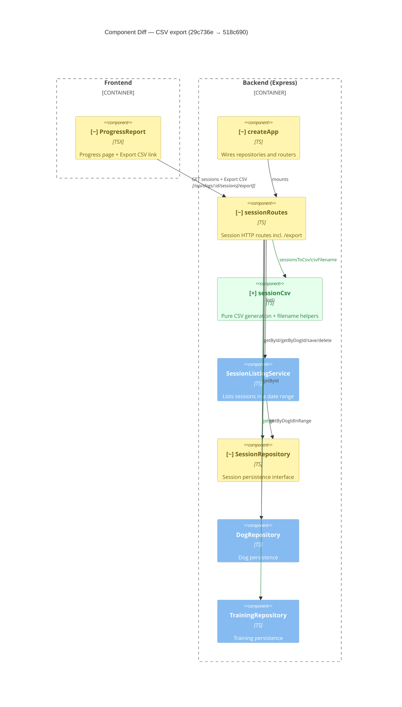

# Component Diagram (diff)

**Base:** `29c736e` — fix(factory): beads/github id confusion (Jo Van Eyck, 2026-09-14)
**Head:** `518c690` — fix: address review feedback (Jo Van Eyck, 2026-09-14)

## Legend
🟢 added  🔴 removed  🟠 changed  ⚪ unchanged (context)

## Evidence
- 🟢 `sessionCsv` — new component `app/backend/sessions/sessionCsv.ts` (`sessionsToCsv`, `csvFilename`, `escapeCsvField`); wired via import in `sessionRoutes.ts`.
- 🟢 `sessionRoutes → trainingRepository` — new edge: export route calls `trainings.getAll()`; `createApp.ts` now passes `trainingRepo`.
- 🟠 `sessionRoutes` — added `/dogs/:dogId/sessions/export` route; new deps on `sessionCsv` and `TrainingRepository`; uses `sessions.getByDogId`.
- 🟠 `SessionRepository` — interface gained `getByDogId(dogId)` (implemented in Fs + Fake repos) to export full history without date bounds.
- 🟠 `createApp` — `sessionRoutes(...)` call gains `trainingRepo` argument.
- 🟠 `ProgressReport` — added Export CSV link to `/api/dogs/:id/sessions/export`.

## Summary
New `sessionCsv` component encapsulates CSV rendering + filename derivation. `sessionRoutes` grows an export endpoint and now depends on `sessionCsv` and `TrainingRepository`; `SessionRepository` adds `getByDogId` so the export covers the dog's full persisted history (fixing the review's date-bound omission). Nothing was removed. The frontend Progress page adds a download link.
