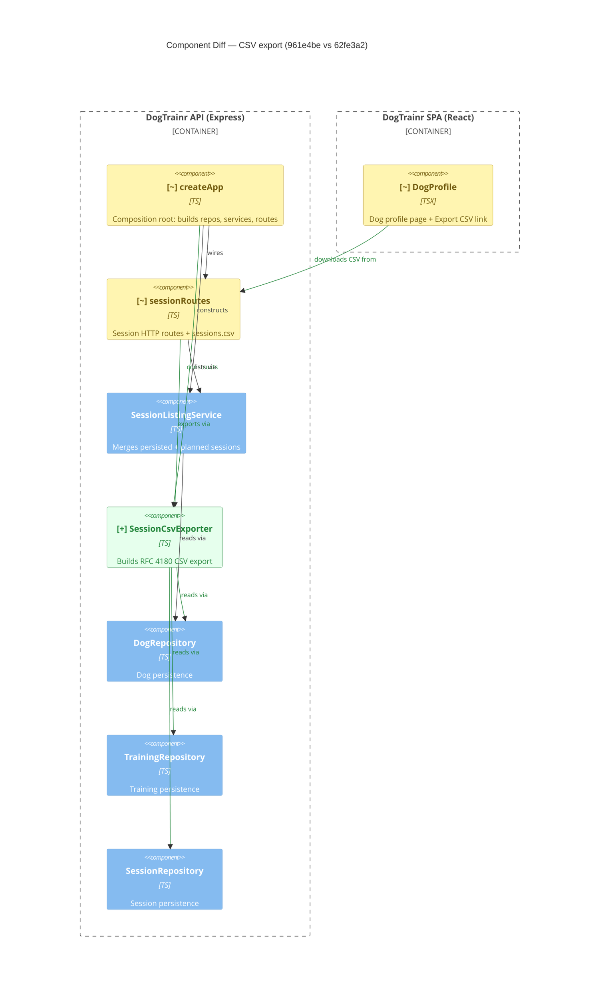

# Component Diagram (diff)

**Base:** `961e4be` — chore(factory): set worker/feature-owner/reviewer/merger tiers to deepseek (Jo Van Eyck, 2026-09-14)
**Head:** `62fe3a2` — fix: address review feedback (CSV formula injection) (jo-clank, 2026-09-14)

## Legend
🟢 added  🔴 removed  🟠 changed  ⚪ unchanged (context)

## Evidence
- 🟢 `SessionCsvExporter` — new component in `app/backend/sessions/SessionCsvExporter.ts`; depends on `DogRepository`, `TrainingRepository`, `SessionRepository` (constructor types).
- 🟢 `createApp → SessionCsvExporter` — `new SessionCsvExporter(dogRepo, trainingRepo, sessionRepo)` in `app/backend/createApp.ts`.
- 🟢 `sessionRoutes → SessionCsvExporter` — new `sessions.csv` handler calls `exporter.export(...)` in `app/backend/sessions/sessionRoutes.ts`.
- 🟢 `SessionCsvExporter → *Repository` — reads via `dogs.getById`, `trainings.getAll`, `sessions.getByDogIdInRange` in `SessionCsvExporter.ts`.
- 🟢 `DogProfile → sessionRoutes` — new `GET /api/dogs/:id/sessions.csv` link in `app/frontend/src/DogProfile.tsx`.
- 🟠 `createApp` — constructor wiring changed to inject the exporter into `sessionRoutes`.
- 🟠 `sessionRoutes` — signature gained `exporter: SessionCsvExporter`; added the CSV route.
- 🟠 `DogProfile` — header block changed to include the export link.

## Summary
One new component, `SessionCsvExporter`, is added to the backend and wired through `createApp` into `sessionRoutes`; it reads the dog, training, and session repositories to emit an RFC 4180 CSV. `sessionRoutes` gains the `GET /api/dogs/:dogId/sessions.csv` endpoint, and `DogProfile` gains a link that calls it. No components were removed and no existing repository/service dependencies were dropped — the change is purely additive plus three configuration/wiring edits.
