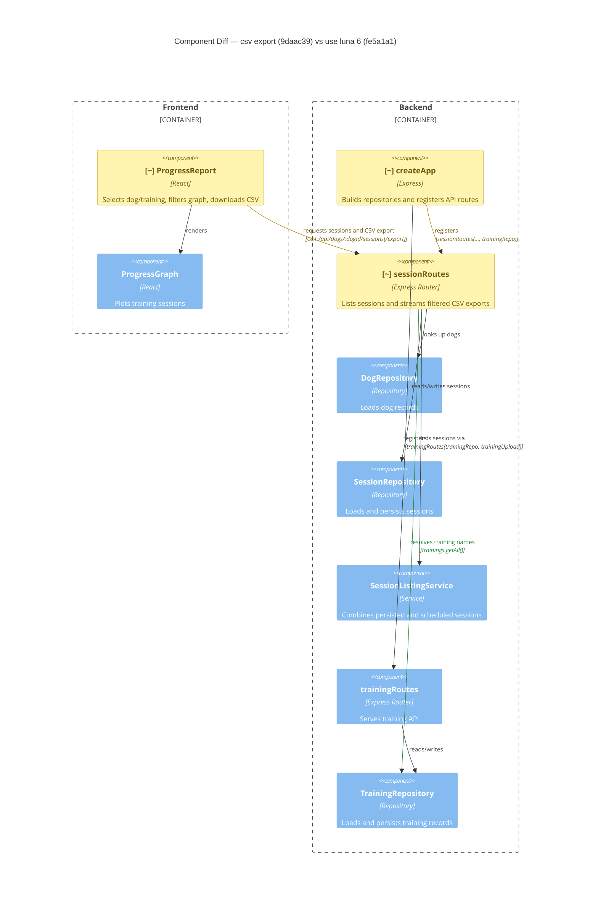

# Component Diagram (diff)

**Base:** `fe5a1a1` — use luna 6 (Jo Van Eyck, 2026-09-24)
**Head:** `9daac39` — csv export (jo-clank, 2026-09-24)

## Legend
🟢 added  🔴 removed  🟠 changed  ⚪ unchanged (context)

## Evidence
- 🟠 `ProgressReport` — added export state/handler and the CSV download request while retaining graph rendering (`app/frontend/src/ProgressReport.tsx`, `ProgressReport.exportCsv`).
- 🟠 `ProgressReport` → `sessionRoutes` — existing session-list request gains a CSV-export operation (`GET /api/dogs/:dogId/sessions/export`, `app/frontend/src/ProgressReport.tsx`, `exportCsv`; `app/backend/sessions/sessionRoutes.ts`, export route).
- 🟠 `createApp` → `sessionRoutes` — registration call now passes `trainingRepo` (`app/backend/createApp.ts`, `createApp`).
- 🟠 `sessionRoutes` — receives `TrainingRepository` and handles the CSV response (`app/backend/sessions/sessionRoutes.ts`, `sessionRoutes`).
- 🟢 `sessionRoutes` → `TrainingRepository` — export calls `trainings.getAll()` to resolve training names (`app/backend/sessions/sessionRoutes.ts`, `GET /dogs/:dogId/sessions/export`).

## Summary
The change adds no components and removes none. It changes the `ProgressReport`, app-factory wiring, and session-router components: the frontend can now request a CSV export, and the session router gains a `TrainingRepository` dependency to resolve training names. The existing dog/session repositories, listing service, training routes, and graph component remain as context.
