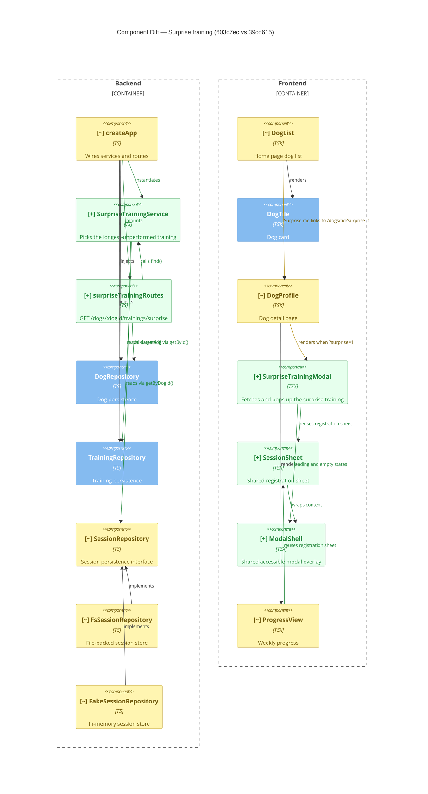

# Component Diagram (diff)

**Base:** `39cd615` — live preview (Jo Van Eyck, 2026-09-23)
**Head:** `603c7ec` — fix: address SonarCloud feedback (jo-clank, 2026-09-23)

## Legend
🟢 added  🔴 removed  🟠 changed  ⚪ unchanged (context)

## Evidence
- 🟢 `SurpriseTrainingService` — new `app/backend/trainings/SurpriseTrainingService.ts`; `find()` reads `trainings.getAll()` + `sessions.getByDogId(dogId)`.
- 🟢 `surpriseTrainingRoutes` — new `app/backend/trainings/surpriseTrainingRoutes.ts`; exposes `GET /dogs/:dogId/trainings/surprise`, calls `service.find(dogId)`.
- 🟢 `SurpriseTrainingModal` — new `app/frontend/src/SurpriseTrainingModal.tsx`; renders `SessionSheet` and `ModalShell`.
- 🟢 `SessionSheet` — new `app/frontend/src/SessionSheet.tsx`; extracted registration form using `ModalShell`.
- 🟢 `ModalShell` — new `app/frontend/src/ModalShell.tsx`; shared accessible overlay.
- 🟠 `createApp` — `app/backend/createApp.ts`; now constructs `SurpriseTrainingService` and mounts `surpriseTrainingRoutes`.
- 🟠 `SessionRepository` — `app/backend/sessions/SessionRepository.ts`; added `getByDogId(dogId)`.
- 🟠 `FsSessionRepository` / `FakeSessionRepository` — added `getByDogId` implementations.
- 🟠 `DogList` — `app/frontend/src/DogList.tsx`; independent `/api/trainings` fetch and per-dog `Surprise me` link to `/dogs/:id?surprise=1`.
- 🟠 `DogProfile` — `app/frontend/src/DogProfile.tsx`; `Surprise me` button, `SurpriseTrainingModal`, keyed `ProgressView` refresh.
- 🟠 `ProgressView` — `app/frontend/src/ProgressView.tsx`; replaced inline registration sheet with `SessionSheet`.

## Summary
**New parts:** a backend `SurpriseTrainingService` + `surpriseTrainingRoutes` exposing `GET /api/dogs/:dogId/trainings/surprise`; and frontend `SurpriseTrainingModal` plus shared `SessionSheet`/`ModalShell`. **Removed:** nothing at component level — the inline registration sheet in `ProgressView` is replaced by the extracted `SessionSheet`. **Changed relationships:** `createApp` now instantiates the surprise service and mounts its routes; `SessionRepository` gained `getByDogId` (both implementations updated); `DogList` and `DogProfile` gain "Surprise me" entry points; `SurpriseTrainingModal` reuses `SessionSheet`/`ModalShell`, and `ProgressView` now reuses `SessionSheet`.