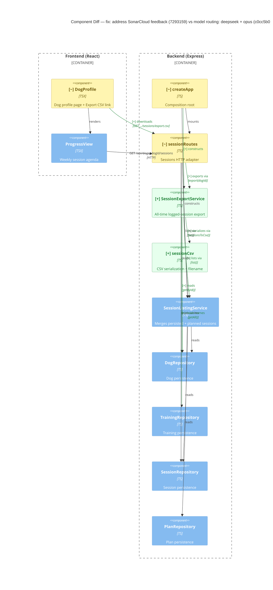

# Component Diagram (diff)

**Base:** `c0cc5b0` — model routing: deepseek + opus (Jo Van Eyck, 2026-10-04)
**Head:** `7293159` — fix: address SonarCloud feedback (jo-clank, 2026-10-04) — tip of PR #38 `feat/37` source changes

```mermaid
C4Component
  title Component Diff — fix: address SonarCloud feedback (7293159) vs model routing: deepseek + opus (c0cc5b0)

  Container_Boundary(fe, "Frontend (React)") {
    Component(dogProfile, "[~] DogProfile", "TSX", "Dog profile page + Export CSV link")
    Component(progressView, "ProgressView", "TSX", "Weekly session agenda")
  }
  Container_Boundary(be, "Backend (Express)") {
    Component(createApp, "[~] createApp", "TS", "Composition root")
    Component(sessionRoutes, "[~] sessionRoutes", "TS", "Sessions HTTP adapter")
    Component(exportSvc, "[+] SessionExportService", "TS", "All-time logged-session export")
    Component(sessionCsv, "[+] sessionCsv", "TS", "CSV serialization + filename")
    Component(listing, "SessionListingService", "TS", "Merges persisted + planned sessions")
    Component(dogRepo, "DogRepository", "TS", "Dog persistence")
    Component(trainingRepo, "TrainingRepository", "TS", "Training persistence")
    Component(sessionRepo, "SessionRepository", "TS", "Session persistence")
    Component(planRepo, "PlanRepository", "TS", "Plan persistence")
  }

  Rel(dogProfile, progressView, "renders")
  Rel(progressView, sessionRoutes, "GET /api/dogs/:dogId/sessions", "HTTP")
  Rel(dogProfile, sessionRoutes, "[+] downloads", "GET .../sessions/export.csv")
  Rel(createApp, sessionRoutes, "mounts")
  Rel(createApp, listing, "constructs")
  Rel(createApp, exportSvc, "[+] constructs")
  Rel(sessionRoutes, listing, "lists via", "list()")
  Rel(sessionRoutes, exportSvc, "[+] exports via", "export(dogId)")
  Rel(sessionRoutes, dogRepo, "reads")
  Rel(sessionRoutes, sessionRepo, "reads/writes")
  Rel(exportSvc, dogRepo, "[+] reads", "getById()")
  Rel(exportSvc, listing, "[+] lists via", "list()")
  Rel(exportSvc, trainingRepo, "[+] reads names", "getAll()")
  Rel(exportSvc, sessionCsv, "[+] serializes via", "sessionsToCsv()")
  Rel(listing, dogRepo, "reads")
  Rel(listing, planRepo, "reads")
  Rel(listing, sessionRepo, "reads")

  UpdateElementStyle(exportSvc, $bgColor="#e6ffed", $borderColor="#22863a", $fontColor="#22863a")
  UpdateElementStyle(sessionCsv, $bgColor="#e6ffed", $borderColor="#22863a", $fontColor="#22863a")
  UpdateElementStyle(dogProfile, $bgColor="#fff5b1", $borderColor="#b08800", $fontColor="#735c0f")
  UpdateElementStyle(createApp, $bgColor="#fff5b1", $borderColor="#b08800", $fontColor="#735c0f")
  UpdateElementStyle(sessionRoutes, $bgColor="#fff5b1", $borderColor="#b08800", $fontColor="#735c0f")

  UpdateRelStyle(dogProfile, sessionRoutes, $lineColor="#22863a", $textColor="#22863a")
  UpdateRelStyle(createApp, exportSvc, $lineColor="#22863a", $textColor="#22863a")
  UpdateRelStyle(sessionRoutes, exportSvc, $lineColor="#22863a", $textColor="#22863a")
  UpdateRelStyle(exportSvc, dogRepo, $lineColor="#22863a", $textColor="#22863a")
  UpdateRelStyle(exportSvc, listing, $lineColor="#22863a", $textColor="#22863a")
  UpdateRelStyle(exportSvc, trainingRepo, $lineColor="#22863a", $textColor="#22863a")
  UpdateRelStyle(exportSvc, sessionCsv, $lineColor="#22863a", $textColor="#22863a")
```

## Legend
🟢 added  🔴 removed  🟠 changed  ⚪ unchanged (context)

## Evidence
- 🟢 `SessionExportService` — new `app/backend/sessions/SessionExportService.ts`; owns the all-time window and completed/skipped filter; depends on `DogRepository`, `SessionListingService`, `TrainingRepository`, `sessionCsv`.
- 🟢 `sessionCsv` — new `app/backend/sessions/sessionCsv.ts` (`sessionsToCsv`, `sessionsFilename`).
- 🟠 `sessionRoutes` — new `exportService` parameter and `GET /dogs/:dogId/sessions/export.csv` in `app/backend/sessions/sessionRoutes.ts`.
- 🟠 `createApp` — constructs and injects `SessionExportService` in `app/backend/createApp.ts`.
- 🟠 `DogProfile` — "Export CSV" download link in the Sessions section action (`app/frontend/src/DogProfile.tsx`).
- ⚪ `SessionListingService` — return type tightened to `ListedSession[]` (`app/backend/shared/types.ts`); no dependency change.

## Summary
New: a `SessionExportService` domain service and a pure `sessionCsv` serializer, which together produce an all-time CSV of a dog's logged sessions. Nothing was removed. Changed relationships: `sessionRoutes` now delegates the new export endpoint to `SessionExportService` (wired in `createApp`), the export service reuses `SessionListingService` and adds a new dependency on `TrainingRepository` for training names, and `DogProfile` gains a direct download link to the export endpoint.
